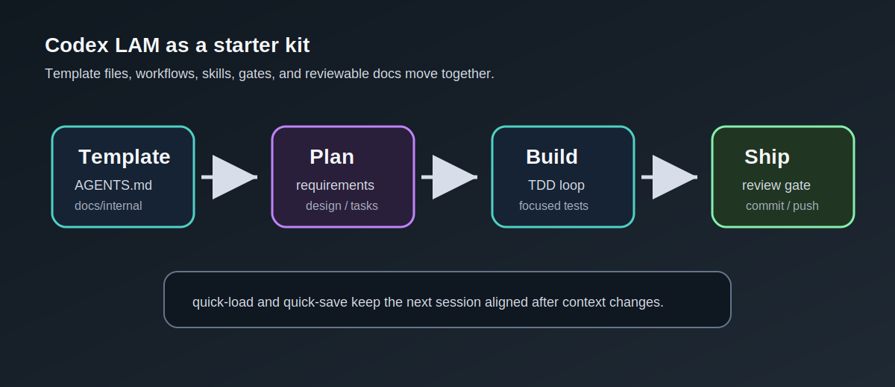
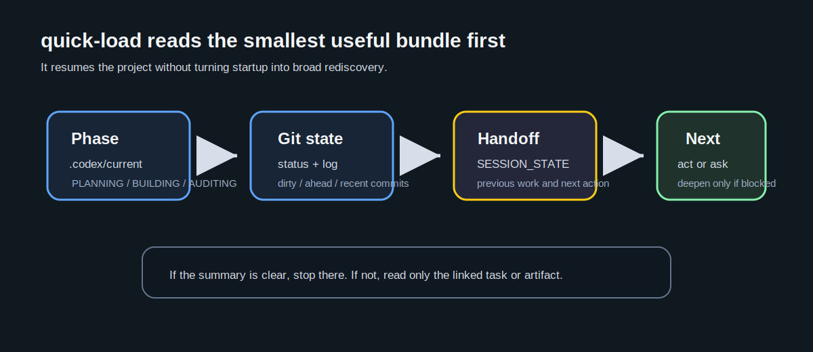

# The Living Architect Model

**"AI は単なるツールではない。パートナーだ。"**

このリポジトリは、Codex App を中心とする大規模言語モデルが、中〜大規模ソフトウェア開発プロジェクトにおいて、自律的な「アーキテクト」兼「ゲートキーパー」として振る舞うためのプロトコルセット **"Living Architect Model"** を定義します。

これらの定義ファイルをプロジェクトルートに配置することで、標準的なコーディングアシスタントを、プロジェクトの整合性と健全性を守る「能動的な守護者」へと変貌させることができます。

## 初めての方へ



| ステップ | リソース | 所要時間 |
|---------|---------|---------|
| 1. 概念を理解する | [スライド](docs/slides/index.html) | 5分 |
| 2. 環境を構築する | [クイックスタート](QUICKSTART.md) | 10分 |
| 3. 日常の使い方を知る | [チートシート](CHEATSHEET.md) | 参照用 |

Fresh repo では `SESSION_STATE.md` がまだ存在しないのが通常です。
最初の Codex App セッションでは、`AGENTS.md` と `.codex/current-phase.md` を入口にして
PLANNING から始め、`quick-save` 後に `SESSION_STATE.md` が作られます。

## コアコンセプト

- **Active Retrieval (能動的検索)**: AI は受動的な記憶に頼るのではなく、能動的にコンテキストを検索・ロードしなければならない。
- **Gatekeeper Role (門番の役割)**: AI は低品質なコードや曖昧な仕様がコードベースに混入するのを阻止する。
- **Zero-Regression (退行ゼロ)**: 厳格な影響分析と TDD サイクルにより、リグレッション（先祖返り）を防ぐ。
- **Multi-Perspective Decisions (多角的意志決定)**: MAGI System（MELCHIOR・BALTHASAR・CASPAR）+ Reflection を用いた堅牢な構造化意思決定プロセス。
- **Command Safety (コマンド安全性)**: 厳格な Allow/Deny リストによる、偶発的な事故の防止。
- **Living Documentation (生きたドキュメント)**: ドキュメントをコードと同様に扱い、すべてのサイクルで動的に更新する。
- **Phase Control (フェーズ制御)**: PLANNING/BUILDING/AUDITING の明示的な切り替えにより、「つい実装してしまう」問題を防止。
- **Approval Gates (承認ゲート)**: サブフェーズ間の明示的な承認により、不完全な成果物での先走りを防止。

## 収録内容

### 憲法・チートシート

| ファイル | 説明 |
|---------|------|
| `AGENTS.md` | Codex 用の憲法。AI のアイデンティティ、基本原則、権限を定義 |
| `CHEATSHEET.md` | クイックリファレンス。コマンド・エージェント一覧 |

### 運用プロトコル (`docs/internal/`)

| ファイル | 説明 |
|---------|------|
| `00_PROJECT_STRUCTURE.md` | 物理構成と命名規則 |
| `01_REQUIREMENT_MANAGEMENT.md` | アイデアから仕様へ (Definition of Ready) |
| `02_DEVELOPMENT_FLOW.md` | 影響分析、TDD、レビューサイクル |
| `03_QUALITY_STANDARDS.md` | コーディング規約と品質ゲート |
| `04_RELEASE_OPS.md` | デプロイと緊急対応プロトコル |
| `05_MCP_INTEGRATION.md` | MCP サーバー連携・MEMORY.md 運用ポリシー（オプション） |
| `06_DECISION_MAKING.md` | 意思決定プロトコル (MAGI System + AoT + Reflection) |
| `07_SECURITY_AND_AUTOMATION.md` | コマンド実行の安全基準 (Allow/Deny List) |
| `10_DISTRIBUTION_MODEL.md` | Codex LAM を GitHub template / starter kit として配布する方針 |
| `99_reference_generic.md` | 一般的な助言とベストプラクティス (Non-SSOT) |

### Codex App 拡張

| ディレクトリ | 説明 |
|-------------|------|
| `.codex/workflows/` | Codex-native のフェーズ運用、quick-load/save、review 手順 |
| `.agents/skills/` | Codex App から使う project skill の候補 |
| `docs/migration/` | 旧 Claude Code 資料の扱いと archive / delete gate の記録 |

### 配布補助文書

| ファイル | 説明 |
|---------|------|
| `CONTRIBUTING.md` | Codex LAM に変更を入れるときの最小ルール |
| `SECURITY.md` | secret、承認境界、外部 tool drift の扱い |

## 使い方

### Option A: テンプレートとして使用 (推奨)

GitHub 上でリポジトリページ上部の **"Use this template"** ボタンをクリックし、この構成済み構造で新しいリポジトリを作成してください。

Codex LAM の配布モデルは [docs/internal/10_DISTRIBUTION_MODEL.md](docs/internal/10_DISTRIBUTION_MODEL.md) を参照してください。
この repo は template / starter kit の母艦として扱い、Codex App では `AGENTS.md`、`.codex/workflows/`、必要な `.agents/skills/` を入口にします。
template 直後に `SESSION_STATE.md` がない場合はセットアップ失敗ではなく、新規プロジェクトの通常状態です。

**参考ドキュメント:**
- [テンプレートからリポジトリを作成する - GitHub Docs (日本語)](https://docs.github.com/ja/repositories/creating-and-managing-repositories/creating-a-repository-from-a-template)
- [Creating a repository from a template - GitHub Docs (English)](https://docs.github.com/en/repositories/creating-and-managing-repositories/creating-a-repository-from-a-template)

### Option B: git clone

```bash
git clone https://github.com/sougetuOte/codex-of-LAM.git my-project
cd my-project
rm -rf .git && git init
```

LAM は `AGENTS.md`、`.codex/workflows/`、`docs/internal/` が連携して動作するため、一式をそのまま使うことを推奨します。旧 Claude Code 資料は Codex runtime の必須構成ではなく、必要な場合は `docs/migration/` の archive / delete gate を参照します。

### Option C: 既存プロジェクトへの導入

既に開発が進んでいるプロジェクトに LAM を導入する場合:



1. プロジェクト内に作業用ディレクトリを作り、LAM リポジトリの ZIP をそこに展開する

```bash
mkdir _lam_source
cd _lam_source
# ZIP をダウンロードして展開
```

2. Codex App で対象プロジェクトを開き、以下のように指示する:

```
_lam_source/ にある Living Architect Model をこのプロジェクトに Codex App 前提で配置してください。
```

3. 既存の要件定義や仕様書がある場合は、それを参照させて適応を指示する:

```
<要件定義ファイル> を参照して、LAM の全ファイルを確認し必要な部分を適応させてください。
```

既存の要件がない場合は、適応せずそのまま使い始めてよい。PLANNING フェーズで要件定義を行った後に適応すればよい。

## フェーズ

| Phase | 用途 | 禁止事項 |
|---------|------|---------|
| PLANNING | 要件定義・設計・タスク分解 | コード生成禁止 |
| BUILDING | TDD実装 | 仕様なし実装禁止 |
| AUDITING | レビュー・監査・リファクタ | PM級の修正禁止（PG/SE級は許可） |

### 承認ゲート

```
requirements → [承認] → design → [承認] → tasks → [承認] → BUILDING → [承認] → AUDITING
```

各サブフェーズ完了時にユーザー承認が必要。未承認のまま次に進むことは禁止。

## コマンドを覚える必要はありません

以下に運用の一覧が続きますが、暗記する必要はありません。AI に「今の状況で使える workflow や skill は？」と聞けば、適切なものを提案してくれます。まずは PLANNING から始めてみてください。

## 作業分担

| 役割 | 用途 | 推奨フェーズ |
|-------------|------|-------------|
| Gatekeeper | 判断、統合、承認ゲート管理 | ALL |
| Worker | disjoint な実装や文書更新 | BUILDING |
| Explorer | read-only 調査、差分把握 | PLANNING / AUDITING |
| Reviewer | findings、残リスク、検証結果の確認 | AUDITING |

## セッション管理コマンド

| コマンド | 用途 |
|---------|------|
| `quick-save` | セーブ（SESSION_STATE.md + 必要なら docs/daily。git 操作なし） |
| `quick-load` | ロード（SESSION_STATE.md + 最小確認 bundle） |

## ワークフロー

| 操作 | 用途 |
|---------|------|
| ship | 論理グループ分け commit / push |
| review | 差分確認、findings、検証結果整理 |
| release | CHANGELOG、tag、GitHub Release |
| wave planning | 次 Wave のタスク選定と実行順序 |
| retro | Wave/Phase 完了時の学習サイクル |

## 推奨モデル

| フェーズ | 推奨モデル |
|---------|----------|
| **PLANNING** | GPT-5.4、必要に応じて context-harvest |
| **BUILDING** | GPT-5.4、単純な read-only/分類は 5.3 系 |
| **AUDITING** | GPT-5.4、不可逆または高リスク判断のみ GPT-5.5 |

## 環境要件

| 要件 | 用途 | 必須/任意 |
|------|------|----------|
| Codex App | AI アシスタント実行環境 | 必須 |
| Python 3.8+ | 補助 CLI / 検証ツールに必要 | 推奨 |
| Git | バージョン管理 | 必須 |
| [gitleaks](https://github.com/gitleaks/gitleaks) | AUDITING / full review で使うシークレットスキャン | 推奨 |

gitleaks が未インストールの場合、シークレットスキャンを含む full review では Green State G5 が FAIL になります。不要な場合は `review-config.json` で `"gitleaks_enabled": false` を設定してください。

## ライセンス

MIT License
