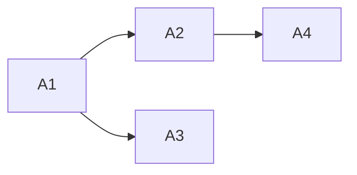

# Structured Thinking Anchor: Slides Codex-native Gate

**議題**: public template の初回 onboarding として、`docs/slides/*` をどう扱うべきか。
**レベル**: 2
**開始**: 2026-05-09 19:53

---

## Phase 0: Grounding

**参照 evidence**:
- `docs/artifacts/2026-05-09-slides-codex-native-harvest-notes.md`
- `docs/artifacts/2026-05-09-template-onboarding-harvest-notes.md`
- `docs/internal/10_DISTRIBUTION_MODEL.md`

**複雑度判定**: Level 2 — 5 deck pair、README 入口、Codex runtime 方針、visual QA が絡む。

---

## AoT Decomposition

| Atom | 判断内容 | 依存 |
|:---|:---|:---|
| A1 | public 初回導線に出してよい slide set を決める | なし |
| A2 | 次の実装 slice を targeted patch にするか full rewrite にするか | A1 |
| A3 | `story-daily` / `story-evolution` を非表示または pending 扱いにするか | A1 |
| A4 | 実装後に必要な verification を決める | A2 |

**依存関係 DAG**:

---

## Atom A1: public 初回導線に出してよい slide set

**[MELCHIOR]**:
- `intro` と `story-newproject` は価値が高い。template 利用者が「何をすればいいか」を視覚で掴める。
- `index` は入口として残し、推奨順をはっきりさせればオンボーディング力が上がる。

**[BALTHASAR]**:
- `story-daily`, `story-evolution`, `architecture` は古い runtime 説明が残り、初回ユーザーを誤誘導する。
- 特に `.claude/skills/` と `.claude/rules/auto-generated/` は、Wave 3 の削除方針と衝突する。

**[CASPAR]**:
- **結論**: public first path は `index` -> `intro` -> `story-newproject` に限定する。
- **Action**: `story-daily`, `story-evolution`, `architecture` は index 上で advanced / pending refresh として扱うか、一時的に弱い導線にする。

---

## Atom A2: targeted patch か full rewrite か

**[MELCHIOR]**:
- full rewrite なら最も綺麗になる。新規が離れるリスクを最小化できる。
- ただし今すぐ全 deck を直すと、入口改善が長引く。

**[BALTHASAR]**:
- HTML slides は見た目崩れのリスクがある。全 rewrite は browser visual QA が必須。
- 古い story 構造を残したまま文言だけ直すと、かえって嘘っぽくなる。

**[CASPAR]**:
- **結論**: 次 slice は targeted public-onboarding patch にする。
- **Action**: `index*`, `intro*`, `story-newproject*` を最小修正し、残り deck は pending label / task へ逃がす。full rewrite は次の独立 wave。

---

## Atom A3: `story-daily` / `story-evolution` の扱い

**[MELCHIOR]**:
- どちらも LAM の魅力を伝える story ではある。完全削除はもったいない。
- 将来的には Codex App の review pane, project skills, quick-save/load, optional workers で再構成できる。

**[BALTHASAR]**:
- 現状のまま初回ユーザーに見せると、slash command と `.claude/` 前提に見える。
- public template において「古いが面白い」は、初回導線では負債になる。

**[CASPAR]**:
- **結論**: 削除せず、first path から外す。index では `pending Codex-native refresh` と明示する。
- **Action**: 実装時はリンクを消すより、警告付き card または advanced section に移す。

---

## Atom A4: verification

**[MELCHIOR]**:
- 文言修正中心なら `rg` と link check で足りる。

**[BALTHASAR]**:
- slides は HTML / visual artifact なので、最低限 browser 目視または screenshot が必要。
- 入口 deck は README から飛ぶため、表示崩れは離脱要因になる。

**[CASPAR]**:
- **結論**: 次実装後は `rg` scan、local link check、in-app browser で `index`, `intro`, `story-newproject` の表示確認を行う。
- **Action**: network CDN が必要な Reveal.js 表示は環境依存なので、少なくとも static HTML の主要 text と navigation を確認する。

---

## Reflection

致命的な見落とし: なし。

ただし、slides は README よりも visual QA の重要度が高い。次セッションでは文面修正だけで完了扱いにしない。

---

## Synthesis

**統合結論**:
- 次セッションの実装 slice は **Slide Public First Path Patch** とする。
- 修正対象は `docs/slides/index*.html`, `docs/slides/intro*.html`, `docs/slides/story-newproject*.html`。
- `docs/slides/story-daily*.html`, `docs/slides/story-evolution*.html`, `docs/slides/architecture*.html` は削除せず、index 上で pending / advanced として初回導線から弱める。
- 実装後 verification は `rg` scan、local link check、in-app browser 目視確認を必須にする。

**Action Items For Next Session**:
1. `index*` の card 構成を、stable first path と pending refresh に分ける。
2. `intro*` の `/full-review` 表現を Codex-native AUDITING / review 表現に置換する。
3. `story-newproject*` の AUDITING 部分を `/full-review` から review pane / worker-assisted audit / Green State へ再表現する。
4. `story-daily*`, `story-evolution*`, `architecture*` の深い rewrite は次 wave に残す。
5. browser で `docs/slides/index.html` と `index-en.html` 起点の navigation を確認する。
