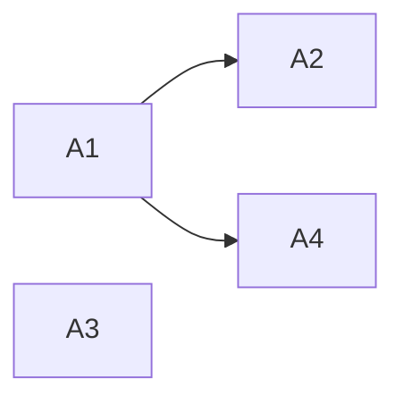

# Structured Thinking Anchor: Template Onboarding

**議題**: Codex LAM を他ユーザーが template / starter kit として使う場合の初期導線を、どこまで今回修正するか。
**レベル**: 2
**開始**: 2026-05-09 19:45

---

## Phase 0: Grounding

**参照 evidence**:
- `docs/artifacts/2026-05-09-template-onboarding-harvest-notes.md`
- `docs/internal/10_DISTRIBUTION_MODEL.md`
- `docs/internal/06_DECISION_MAKING.md`

**複雑度判定**: Level 2 — README / QUICKSTART / CHEATSHEET / slides にまたがり、fresh repo と既存 repo 導入の両方へ影響する。

---

## AoT Decomposition

| Atom | 判断内容 | 依存 |
|:---|:---|:---|
| A1 | 今回の修正対象を README / QUICKSTART / CHEATSHEET に限定するか | なし |
| A2 | slides の旧 command / `.claude` 表現を今回まとめて直すか | A1 |
| A3 | fresh repo で `SESSION_STATE.md` がない状態を入口文書へ明示するか | なし |
| A4 | 日英差分を同じ wave で同期するか | A1 |

**依存関係 DAG**:

---

## Atom A1: 今回の修正対象

**[MELCHIOR]**:
- 初回利用者が最初に読む 6 ファイルを直すだけで、template としての印象は大きく改善する。
- README / QUICKSTART / CHEATSHEET は差分がレビューしやすく、すぐ Green に持っていける。

**[BALTHASAR]**:
- slides まで一気に触ると、HTML 表示や story 文脈の崩れを招く。
- 初期導線の修正と visual onboarding の再設計は評価軸が違う。

**[CASPAR]**:
- **結論**: 今回は README / QUICKSTART / CHEATSHEET の日英 6 ファイルを baseline_now とする。
- **Action**: slides は finding として残し、別 sub-wave で目視確認込みにする。

---

## Atom A2: slides の扱い

**[MELCHIOR]**:
- slides は README から最初に誘導されるため、本来は早く直したい。
- `.claude/` 表現は public template としてかなり目立つリスクがある。

**[BALTHASAR]**:
- `story-daily` や `story-evolution` は古い slash-command 前提の物語構造を含む。
- 単純置換では Codex App の自然言語 / skill 呼び出し / review pane の説明として不自然になる。

**[CASPAR]**:
- **結論**: 今回は slides を直接直さず、README / QUICKSTART に「slides は概念把握用。操作は本文を優先」と分かる導線を置く。
- **Action**: slides Codex-native refresh を次 wave の task として残す。

---

## Atom A3: `SESSION_STATE.md` がない fresh repo

**[MELCHIOR]**:
- `SESSION_STATE.md` がなければ新規プロジェクトとして始める、という一文は初回失敗を防ぐ。
- quick-load の強みを保ちつつ、template 初回状態との矛盾をなくせる。

**[BALTHASAR]**:
- `SESSION_STATE.md` が Git 管理外であることを理解していないユーザーは、missing file をセットアップ失敗と誤解しやすい。

**[CASPAR]**:
- **結論**: README / QUICKSTART / CHEATSHEET で「fresh repo では `SESSION_STATE.md` がなくてよい」を明示する。
- **Action**: quick-load 例文に fallback を含める。

---

## Atom A4: 日英同期

**[MELCHIOR]**:
- template 利用者は英語版を入口にする可能性が高く、情報差分を減らす価値がある。

**[BALTHASAR]**:
- 日本語 canonical / 英語追従の方針を保つなら、英語版だけ独自に膨らませすぎない。

**[CASPAR]**:
- **結論**: 今回触る範囲では日英を同期する。日本語版で決めた文言を英語版へ追従する。
- **Action**: 英語版 README の protocol list も日本語版と揃える。

---

## Reflection

致命的な見落とし: なし。

注意点:
- GitHub template の現 URL や Codex App の現在 UI は drift し得るが、今回の修正は文書内の整合性改善であり外部仕様判断ではない。
- slides の残存問題は public template 前に必ず別 gate で扱う。

---

## Synthesis

**統合結論**:
- 今回は `README.md`, `README_en.md`, `QUICKSTART.md`, `QUICKSTART_en.md`,
  `CHEATSHEET.md`, `CHEATSHEET_en.md` を修正する。
- fresh repo では `SESSION_STATE.md` が存在しないのが通常であることを明示する。
- README の `/full-review` 表現は Codex-native な `review` / auditing workflow 表現へ置き換える。
- slides の `/...` command と `.claude/` 残存は今回の direct edit 対象外とし、次 sub-wave の明示タスクにする。

**Action Items**:
1. 6 つの入口文書を小さく修正する。
2. `rg` で README / QUICKSTART / CHEATSHEET の旧 control-surface 表現を確認する。
3. `git diff --check` を実行する。
4. slides refresh の未解決リスクを最終報告へ残す。
