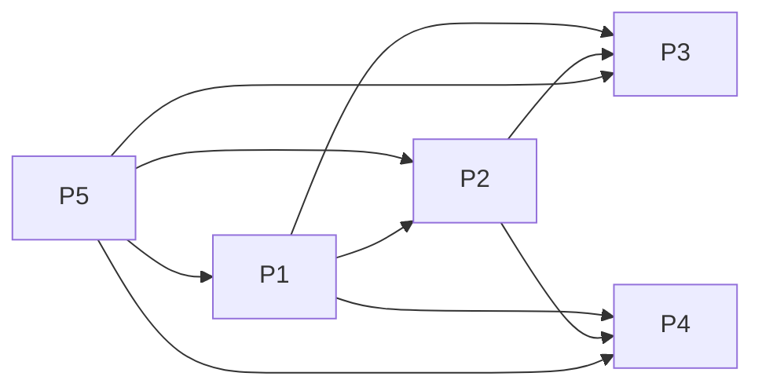
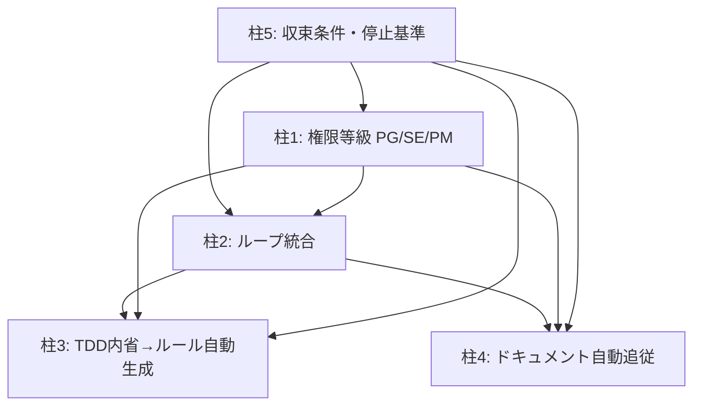

# 機能仕様書: v4.0.0 免疫系アーキテクチャ（要件分析中間成果物）

> **注意**: 本文書は requirement-analyst サブエージェントによる要件分析の中間成果物です。
> **正式な要件定義書は `docs/specs/v4.0.0-immune-system-requirements.md`** を参照してください。
> 本文書内の数値（ループ回数等）は正式要件定義書と異なる場合があります。正式値は要件定義書に従います。
>
> v4.3.x にて `docs/specs/` → `docs/artifacts/` に移動（中間成果物のため）。

## メタ情報

| 項目 | 内容 |
|------|------|
| ステータス | Draft |
| 作成日 | 2026-03-08 |
| 更新日 | 2026-03-08 |
| 担当 | requirement-analyst サブエージェント |
| 関連ADR | 未作成（design-architect フェーズで策定） |
| 前バージョン | v3.9.0（憲法型ハーネス） |

---

## 0. AoT Decomposition — 要件前処理

**議題**: LAM v4.0.0「免疫系」アーキテクチャへの進化

**Atom 分解**:

| Atom | 判断内容 | 依存 |
|------|----------|------|
| P5 | 収束条件・停止基準の定義 | なし |
| P1 | 権限等級システム（PG/SE/PM）の定義 | P5 |
| P2 | ループ統合（full-review + 構造チェック）の統合設計 | P1, P5 |
| P3 | TDD内省→ルール自動生成の設計 | P1, P2, P5 |
| P4 | ドキュメント自動追従の設計 | P1, P2, P5 |

**依存関係**:



**注**: P5（収束条件）は全柱の前提条件。設計は最初に行い、実装は最後に統合する。

---

## 1. 概要

### 1.1 目的

第2世代 LAM（憲法型ハーネス）は「人間が書いたルールをAIが遵守する」モデルである。
第3世代「免疫系」は「AIが経験から自律的にルールを育て、人間は方針承認に専念する」モデルへの進化を目指す。

現状の課題:
- ルールは人間が手動で追記しないと更新されない
- `full-review` は実行のたびに人間の監視を要する
- ドキュメントと実装の乖離は人間が気付いて手動修正する必要がある
- 何をAIが自律判断してよいかの基準が曖昧

解決後の理想状態:
- 繰り返し発生した問題はAIが自動でルール化し、再発を防止する
- レビューループは収束条件を満たすまで自動継続し、人間の介入は例外のみ
- 仕様書とコードの同期はAIが提案し、人間が承認するワークフローになる
- PG/SE/PM の三段階で「AIが判断してよい範囲」が明確に定義されている

### 1.2 コンセプト: 免疫系とは

生物の免疫系は:
- 既知の脅威（パターン）を記憶し、次回は自動排除する
- 未知の脅威は隔離してエスカレーションする
- 自己（正常）と非自己（異常）を区別する基準を継続的に学習する

LAM v4.0.0 はこれを模倣する:
- 既知のTDD失敗パターン → 自動ルール適用（PG/SE級）
- 未知のパターン → 仮説として記録し人間に判断を仰ぐ（PM級）
- 正常状態（Green + lint + 仕様整合）を定義し、逸脱を自動検知する

### 1.3 スコープ

**含む:**
- 柱1: 権限等級システム（PG/SE/PM）の定義と `.claude/settings.json` への反映
- 柱2: ループ統合（full-review の自動ループ化）
- 柱3: TDD内省→ルール自動生成（MVP: 仮説記録まで）
- 柱4: ドキュメント自動追従（doc-writer サブエージェントの自律化）
- 柱5: 収束条件・停止基準の定義

**含まない（第4世代以降）:**
- 複数プロジェクト間でのルール共有
- 機械学習モデルによるパターン認識
- 外部CI/CDシステムとの統合

---

## 2. 柱5: 収束条件・停止基準

> 設計上の理由から、柱5を最初に定義する。全柱がこの定義に依存する。

### User Story

```
As a LAM利用者（開発者）,
I want ループが「いつ止まるか」「なぜ止まるか」を事前に知りたい,
So that 無限ループによるコスト爆発と、早期停止による品質低下を防げる.
```

### Problem Statement

**現状**: `full-review` のループは「最大2回」という経験則で止まる。収束の定義が曖昧。
**理想**: 収束条件が明文化され、条件達成時は自動停止、達成不能と判断した時は人間にエスカレーションする。

### 機能要件

| ID | 要求 | 優先度 |
|----|------|--------|
| FR-P5-001 | 正常状態（Green State）の定義 | Must |
| FR-P5-002 | 収束判定ロジックの定義 | Must |
| FR-P5-003 | 最大反復回数の設定（コスト上限） | Must |
| FR-P5-004 | エスカレーション条件の定義 | Must |
| FR-P5-005 | コンテキスト消費量の監視 | Should |

#### FR-P5-001: Green State（正常状態）の定義

**Green State** とは以下の全条件を同時に満たす状態である:

| 条件 | 測定方法 | 許容閾値 |
|------|----------|---------|
| テスト全パス | テストランナーの exit code = 0 | 0件の失敗 |
| lint 全パス | lint ツールの exit code = 0 | 0件のエラー（warningは設定可） |
| 仕様差分ゼロ | 実装と `docs/specs/` の乖離チェック | Critical 0件 |
| Critical Issue ゼロ | 監査レポートの Critical カウント | 0件 |

**受入条件**:
- [ ] Green State の定義が `.claude/rules/` に明文化されている
- [ ] 各条件の測定コマンドが定義されている
- [ ] プロジェクト固有の追加条件を設定可能である

#### FR-P5-002: 収束判定ロジック

```
収束 = Green State を達成
非収束かつ反復継続 = Green State 未達 かつ 反復回数 < 最大値
非収束かつ停止 = Green State 未達 かつ 反復回数 >= 最大値
```

**受入条件**:
- [ ] 各サイクル終了時に収束判定が実行される
- [ ] 収束時は自動停止して完了報告を出す
- [ ] 非収束・停止時はエスカレーションレポートを出す

#### FR-P5-003: 最大反復回数（コスト上限）

| 操作 | デフォルト最大回数 | 理由 |
|------|------------------|------|
| full-review ループ | 3回 → **実装では5回に変更** | 3回では差分チェック＋フルスキャンで不足するケースがあるため |
| TDD修正サイクル | 5回 | テストは5回以内に安定化するはず |
| doc-sync 提案 | 2回 | 承認がなければ進まない |

**受入条件**:
- [ ] 最大回数は設定ファイルで変更可能
- [ ] 最大回数到達時は必ず人間に報告する

#### FR-P5-004: エスカレーション条件（人間介入が必要なケース）

以下のいずれかに該当する場合、ループを停止して人間に判断を仰ぐ:

| 条件 | 理由 |
|------|------|
| 同一 Issue が2サイクル連続で再発 | 修正アプローチが根本的に誤っている可能性 |
| PM級の変更が必要と判定 | 権限外の判断をAIがしてはならない |
| コンテキスト残量が20%以下 | コンテキスト枯渇によるエラーを防止 |
| 最大反復回数到達 | コスト上限 |
| テスト数が突然減少 | テスト削除による不正な「パス」の防止 |

**受入条件**:
- [ ] エスカレーション時は理由を明示する
- [ ] エスカレーション後のリカバリ手順を提示する
- [ ] テスト数の監視（前回との差分チェック）を実装する

#### FR-P5-005: コンテキスト消費量の監視

**受入条件**:
- [ ] ループ開始時にコンテキスト残量を確認する
- [ ] ループ途中でコンテキストが20%を下回った場合は一時停止する
- [ ] `SESSION_STATE.md` に現在の進捗を保存してから停止する

### 3 Agents Analysis（柱5）

**[Affirmative]**:
- 収束条件を明文化することで「どこまでAIに任せてよいか」の境界が明確になる
- コスト上限を設定することで $100/月のプラン内でも安心して自動ループを使える
- エスカレーション条件はユーザーの信頼感を高める

**[Critical]**:
- 「仕様差分ゼロ」の判定は曖昧になりやすい。自動判定が難しい
- 最大回数の設定値は経験値が少ない段階では根拠が薄い
- コンテキスト残量の監視は Claude Code の内部情報に依存するため実装が困難

**[Mediator]**:
- 「仕様差分ゼロ」はまず Critical Issue ゼロで代替し、段階的に精度を上げる
- 最大回数はデフォルト値を定めて運用から調整する（設定可能にする）
- コンテキスト監視は20%ルール（既存 CLAUDE.md の規則）を援用する

### MVP vs 完全実装（柱5）

| | MVP | 完全実装 |
|-|-----|---------|
| Green State | テスト+lint の2条件のみ | 仕様差分ゼロを含む4条件 |
| 収束判定 | 手動確認後に次ループ判断 | 自動判定 |
| 最大回数 | ハードコードで3回 | 設定ファイルで変更可能 |
| エスカレーション | テキスト報告のみ | 構造化レポート + リカバリ手順 |

---

## 3. 柱1: 権限等級システム（PG/SE/PM）

### User Story

```
As a LAM利用者（開発者）,
I want AIが行う変更を「報告不要」「報告あり」「要承認」の3段階で制御したい,
So that 信頼できる範囲はAIに任せつつ、重要な判断は人間がコントロールできる.
```

### Problem Statement

**現状**: `settings.json` に allow/ask/deny があるが、これはコマンド単位の制御。
「何をやったか」の変更内容に基づく等級制御ではない。
何がAIの自律範囲で何が人間の承認が必要かの基準が CLAUDE.md や phase-rules.md に散在し、一貫性がない。

**理想**: PG/SE/PM の3等級が明文化され、全エージェント・全コマンドがこの基準に従う。
ユーザーは「AIが今何をしようとしているか」と「それが何等級の変更か」を常に把握できる。

### PG/SE/PM 分類基準（詳細定義）

#### PG（プログラマ級）— 自律実行、報告不要

AIが単独で判断・実行・完了してよい変更。事後報告も不要。

| カテゴリ | 具体例 | 判断基準 |
|---------|--------|---------|
| フォーマット修正 | インデント整形、末尾スペース除去 | 動作に影響しない |
| typo修正 | コメント・文字列の誤字 | 意味が明確に誤り |
| lint違反修正 | 未使用import削除、行長制限 | linterが指摘したもの |
| テスト失敗の自明な修正 | アサーション値のズレ（仕様は正しい） | テスト自体は変えない |
| ドキュメントの誤字・リンク切れ | README の typo | 内容の意味は変わらない |

**特記**: PG級でも「迷ったらSE級」を原則とする。

#### SE（システムエンジニア級）— 実行後に報告

実行はAIが判断するが、完了後にユーザーへ変更内容を報告する。

| カテゴリ | 具体例 | 判断基準 |
|---------|--------|---------|
| テストの追加 | 未カバーのエッジケースにテスト追加 | 既存テストを変更しない |
| 内部リファクタリング | メソッド抽出、変数名変更 | 公開APIが変わらない |
| 軽微なAPI調整 | オプション引数の追加（デフォルト値あり） | 既存の呼び出しが壊れない |
| 仕様書の細部更新 | 実装済み内容を仕様書に反映 | 新たな設計判断を含まない |
| 依存関係のパッチ更新 | `1.2.3` → `1.2.4`（セキュリティパッチ） | マイナー/メジャーは含まない |

#### PM（プロジェクトマネージャ級）— 判断を仰ぐ（実行前に確認）

実行前に必ずユーザーの承認を得る。AIは提案のみ行う。

| カテゴリ | 具体例 | 判断基準 |
|---------|--------|---------|
| 仕様変更 | 機能の動作を変える修正 | `docs/specs/` の更新を伴う |
| アーキテクチャ変更 | モジュール分割、依存関係の再構成 | 複数ファイルへの広範な影響 |
| フェーズの巻き戻し | BUILDING中に PLANNING に戻る | フェーズルールの逸脱 |
| ルールの追加・変更 | `.claude/rules/` の内容変更 | ガードレールの変更 |
| 外部依存の追加 | 新しいライブラリの導入 | `package.json` 等の変更 |
| テストの削除・大幅変更 | テストの振る舞いを変える | 品質保証ラインの変更 |

### 機能要件

| ID | 要求 | 優先度 |
|----|------|--------|
| FR-P1-001 | PG/SE/PM 分類基準の明文化 | Must |
| FR-P1-002 | 各エージェントでの等級確認プロセス | Must |
| FR-P1-003 | PreToolUse フック相当の事前判定 | Must |
| FR-P1-004 | SE級の事後報告フォーマット | Must |
| FR-P1-005 | PM級のエスカレーション・プロセス | Must |
| FR-P1-006 | 権限等級ログの記録 | Should |

#### FR-P1-003: PreToolUse 相当の事前判定

Claude Code の `PreToolUse` フック機能または `.claude/settings.json` の
allow/ask/deny を活用し、ツール呼び出し前に等級判定を行う。

```
変更しようとしているツール・コマンドを受け取る
  ↓
PG/SE/PM のどの等級か判定する
  ↓
PG: そのまま実行
SE: 実行 → 完了後に報告キューに追加
PM: 実行を保留 → ユーザーに提案を提示 → 承認を待つ
```

**受入条件**:
- [ ] 変更開始前に等級を宣言する（「これはSE級の変更です」）
- [ ] PM級の変更は承認なしに実行されない
- [ ] PG級の変更は後からでも変更履歴で確認できる

#### FR-P1-004: SE級の事後報告フォーマット

```
[SE報告] <変更内容の要約>
- 変更ファイル: <ファイルパス>
- 変更内容: <具体的な変更>
- 理由: <なぜこの変更が必要だったか>
- 確認事項: <ユーザーに確認してほしい点（あれば）>
```

**受入条件**:
- [ ] SE報告は変更完了後、次のユーザーメッセージ前に出力される
- [ ] 複数のSE変更がある場合はまとめて報告できる
- [ ] SE報告に対してユーザーが「取り消し」を指示できる

#### FR-P1-005: PM級のエスカレーション・プロセス

```
[PM判断依頼] <変更の種類>

提案内容: <具体的に何をしたいか>
理由: <なぜこの変更が必要か>
影響範囲: <変更が及ぼす範囲>
代替案: <他の選択肢（あれば）>

→ 承認 / 修正指示 / 却下
```

**受入条件**:
- [ ] PM依頼はユーザーの応答を待つ（タイムアウトなし）
- [ ] ユーザーが「却下」した場合、代替アプローチを提案する
- [ ] PM依頼の内容は `docs/tasks/` または `docs/memos/` に記録される

### 3 Agents Analysis（柱1）

**[Affirmative]**:
- 明確な権限基準があることで、AIとユーザーの信頼関係が構築できる
- PG級を明確化することで、AIが「確認しすぎる」問題を解消できる
- 既存の allow/ask/deny との自然な対応関係がある

**[Critical]**:
- PG/SE/PMの境界は曖昧。「これはSEか PMか」の判断をAIが誤るリスク
- 「迷ったらSE級」原則を徹底しないと、本来PM級の変更がSEになりうる
- 権限等級の学習コストがユーザーにも発生する

**[Mediator]**:
- 境界の曖昧さは「具体例テーブル」で緩和し、新例は運用から蓄積する
- 「迷ったらSE級」を全エージェント定義に明記する
- ユーザー向けにはCHEATSHEET.mdに一覧表を追加する

### MVP vs 完全実装（柱1）

| | MVP | 完全実装 |
|-|-----|---------|
| 定義 | `.claude/rules/` への分類基準追記 | 全エージェント定義への組み込み |
| 判定 | テキストベースの宣言のみ | PreToolUse フックによる自動判定 |
| 報告 | SE報告フォーマットの定義 | 自動報告キューの実装 |
| ログ | なし | `.claude/states/` への権限ログ記録 |

---

## 4. 柱2: ループ統合（full-review + 構造チェック）

### User Story

```
As a LAM利用者（開発者）,
I want コードを書いた後に1つのコマンドを叩けば、品質基準を満たすまで自動で修正が続き、
完了したら結果だけ見ればいい状態にしたい,
So that 個別の問題修正と全体整合性チェックの両方を手動で管理する認知負荷を減らせる.
```

### Problem Statement

**現状**:
- `full-review` は「監査→修正→検証」を1回実行するが、修正後に再発や新たな問題が出ることがある
- 差分ベースのチェック（速い）と全体スキャン（遅いが正確）が別々
- ループ継続の判断は毎回ユーザーに求められる
- 収束条件が「最大2回」という経験則のみ

**理想**:
- 収束条件（P5で定義）を満たすまでループが自動継続する
- 毎サイクルは差分チェック（速い）、最終サイクルは全体スキャン（正確）の2層
- 権限等級（P1で定義）に基づいて、PG/SE級は自動修正、PM級は提案して停止

### ループ設計

```
/auto-review <target> を起動
  ↓
[サイクル開始]
  |
  ├─ 差分ベースチェック（毎回）
  |   - 前回からの変更ファイルのみ対象
  |   - lint + テスト実行
  |   - 新規 Issue の検出
  |
  ├─ Issue 分類（PG/SE/PM）
  |
  ├─ PG 級: 自動修正（報告不要）
  ├─ SE 級: 自動修正（報告キューに追加）
  ├─ PM 級: ループ停止 → PM判断依頼
  |
  ├─ [収束判定（P5定義）]
  |   Green State 達成? → [最終全体スキャン] → 完了報告
  |   最大回数到達? → エスカレーション報告
  |   同一Issue再発? → エスカレーション報告
  |
  └─ [次サイクル]

[最終全体スキャン]（収束直前のみ）
  - 全ファイル対象の完全監査
  - 仕様差分チェック
  - SE報告の一括出力
```

### 機能要件

| ID | 要求 | 優先度 |
|----|------|--------|
| FR-P2-001 | 差分ベース軽量チェック（毎サイクル） | Must |
| FR-P2-002 | 全体スキャン（最終サイクルのみ） | Must |
| FR-P2-003 | Issue の権限等級自動分類 | Must |
| FR-P2-004 | PG/SE級の自動修正実行 | Must |
| FR-P2-005 | PM級での自動停止とエスカレーション | Must |
| FR-P2-006 | P5定義の収束条件による自動終了 | Must |
| FR-P2-007 | サイクル進捗レポート | Should |
| FR-P2-008 | Ralph Wiggum パターン（Stop hook）の統合 | Should |

#### FR-P2-001: 差分ベース軽量チェック

**受入条件**:
- [ ] 前回チェックからの変更ファイルのみをスキャン対象にする
- [ ] 変更ファイルが0件の場合はスキャンをスキップして収束判定に進む
- [ ] git diff を用いて変更ファイルを特定する

#### FR-P2-002: 全体スキャン

**受入条件**:
- [ ] 全体スキャンはループの最終サイクルのみ実行する
- [ ] full-review Phase 1（並列監査）と同等の深度で実行する
- [ ] 仕様差分チェック（`docs/specs/` との比較）を含む

#### FR-P2-003: Issue の権限等級自動分類

各 Issue を検出した際に、P1で定義した分類基準に従って PG/SE/PM を判定する。

**受入条件**:
- [ ] 全 Issue に等級タグが付く（例: `[PG]`, `[SE]`, `[PM]`）
- [ ] 等級判定の根拠を明示する
- [ ] 判定に自信がない場合は上位等級（SE→PM方向）に丸める

#### FR-P2-008: Ralph Wiggum パターン（Stop hook）

Claude Code の Stop hook 機能を活用し、ループの終了条件チェックを自動化する。

```yaml
# .claude/hooks/stop-check.yaml（設計案）
on: loop_iteration_complete
check:
  - green_state: true   # P5定義の収束条件
  - iteration_count: < max_iterations
  - pm_issue_pending: false
action:
  continue_if_not_converged: true
  stop_on_pm_issue: true
```

**受入条件**:
- [ ] Stop hook が設定されていない場合でも手動ループとして動作する
- [ ] Stop hook の設定方法がドキュメント化されている

### 3 Agents Analysis（柱2）

**[Affirmative]**:
- 差分ベースチェックにより、大規模プロジェクトでも高速なフィードバックが得られる
- 自動ループにより、開発者は別の作業に集中できる
- Ralph Wiggum パターンは既に Claude Code が実装している機能であり、実装コストが低い

**[Critical]**:
- 自動修正がチェーンすると、予期しない方向に変更が積み重なるリスクがある
- 差分の境界が不明確な場合（大規模リファクタリング後など）、差分チェックが機能しない
- PM級 Issue でループが頻繁に止まると、自動化の恩恵が薄れる

**[Mediator]**:
- SE級の自動修正は1件ずつ実行し、各修正後に最小限のテストを回す（ドミノ防止）
- 差分境界は git diff の変更ファイルリストで定義し、境界不明確時はフルスキャンにフォールバック
- PM級 Issue の発生頻度は柱3（ルール自動生成）で長期的に低減する

### MVP vs 完全実装（柱2）

| | MVP | 完全実装 |
|-|-----|---------|
| ループ制御 | 手動確認で継続判断 | 自動収束判定 |
| チェック層 | 全体スキャンのみ（現状の full-review） | 差分+全体の2層 |
| 等級分類 | テキスト表示のみ | 自動分岐（PG自動修正 / PM停止） |
| Stop hook | なし | Ralph Wiggum パターン統合 |

---

## 5. 柱3: TDD内省→ルール自動生成

### User Story

```
As a LAM利用者（開発者）,
I want TDDのサイクルでよく起きる失敗パターンを、AIが記録して次回から自動的に防いでほしい,
So that 同じ問題で何度も手動介入する必要がなくなり、プロジェクト固有の品質ルールが自然に育つ.
```

### Problem Statement

**現状**:
- `.claude/rules/` は人間が手動で追記する。一度きり学習のコストが高い
- TDDサイクルで同じパターンの失敗が繰り返されても、ルール化されない
- `phase-rules.md` の「R-5以降を追加可」は人間が担当している

**理想**:
- AIがTDDの失敗パターンを観察・記録し、信頼度が高まったら自動でルール候補を生成する
- 人間は「このルールを採用するか」の最終承認をするだけでよい
- `.claude/rules/` が「経験から育つ生きたドキュメント」になる

### 信頼度モデル

| 観測回数 | 状態 | アクション |
|---------|------|-----------|
| 1回 | 観測（ノイズの可能性） | `docs/memos/tdd-patterns/` にパターン記録ファイルを作成 |
| 2回 | 仮説（有意な可能性） | 仮説として記録、ユーザーに通知 |
| 3回以上 | 確証（ルール候補） | ルール案を生成し、承認を求める |

等級との対応:
- **PG級ルール**: 3回以上の確証 → `phase-rules.md` に自動追加（SE報告）
- **SE級ルール**: 3回以上の確証 → 提案として記録（PM承認待ち）
- **PM級ルール**: 常に人間判断 → 提案のみ

### パターン記録フォーマット

```markdown
## パターン記録: <パターン名>

| 項目 | 内容 |
|------|------|
| 初回観測 | YYYY-MM-DD |
| 最終観測 | YYYY-MM-DD |
| 観測回数 | N回 |
| 信頼度 | 仮説 / 確証 |
| 等級 | PG / SE / PM |

### 失敗パターン
<何がどう失敗したか>

### 根本原因
<なぜ失敗したか>

### 生成ルール案
```
- [ ] <テスト可能なルール記述>
```

### 適用コンテキスト
<このルールが有効な状況>
```

### 機能要件

| ID | 要求 | 優先度 |
|----|------|--------|
| FR-P3-001 | TDD失敗パターンの観測・記録 | Must |
| FR-P3-002 | 信頼度の追跡と状態遷移 | Must |
| FR-P3-003 | PG級ルールの自動生成と追加 | Should |
| FR-P3-004 | SE/PM級ルールの提案と記録 | Must |
| FR-P3-005 | ルール重複の検出と統合 | Should |
| FR-P3-006 | 誤ルールの取り消しメカニズム | Must |

#### FR-P3-001: TDD失敗パターンの観測・記録

**観測トリガー**:
- テストが Red から Green にならない時
- 同じエラーメッセージが2回以上出現した時
- lint が同じ違反を2回以上報告した時

**受入条件**:
- [ ] 失敗パターンは `.claude/tdd-patterns.log`（サマリー）および `docs/memos/tdd-patterns/`（詳細）に記録される
- [ ] 記録にはパターン名、失敗内容、根本原因、初回観測日が含まれる
- [ ] 同一パターンの重複記録を防ぐ（既存パターンとのマッチング）

#### FR-P3-006: 誤ルールの取り消しメカニズム

自動生成されたルールが誤りだった場合の取り消し手順が必要である。

**受入条件**:
- [ ] 各自動生成ルールに「生成元パターン」のリンクが付く
- [ ] ユーザーがルールを `deprecated` マークできる
- [ ] deprecated ルールは適用されなくなり、パターン記録に「誤検知」が記録される

### 3 Agents Analysis（柱3）

**[Affirmative]**:
- 最もイノベーティブな柱。LAM が「育つ」という概念を実現する
- 信頼度モデルにより、誤ルールの導入を防ぐ安全弁がある
- 人間は承認だけでよく、認知負荷が下がる

**[Critical]**:
- 最も実装リスクが高い柱。AIが「パターンを認識する」ロジックが複雑
- 誤ったルールが自動適用されると、後からの検出・修正が困難
- 「3回で確証」の閾値は恣意的で、プロジェクト特性に依存する
- PG級の自動追加は慎重にすべき。ルールの追加はPM級にすべきでは？

**[Mediator]**:
- MVP では「観測・記録・提案」のみとし、自動追加は完全実装に延期する
- MVPでは全ルールをSE報告（ユーザーへの通知）で対処し、承認フローを経る
- 「3回で確証」は初期値として採用し、運用から調整する
- Critical Agentの指摘を受けてMVPではPG級自動追加を行わない

### MVP vs 完全実装（柱3）

| | MVP | 完全実装 |
|-|-----|---------|
| 観測 | `.claude/tdd-patterns.log` + `docs/memos/tdd-patterns/` に記録 | TDDサイクルからの自動抽出 |
| 信頼度追跡 | テーブルを手動更新 | 自動カウントと状態遷移 |
| ルール生成 | AIが提案、人間が承認・手動追記 | 承認後に自動追記 |
| 取り消し | 手動で deprecated マーク | コマンドで一括管理 |

**MVPの重点**: 仕組みと形式の確立。自動化は段階的に導入する。

---

## 6. 柱4: ドキュメント自動追従

### User Story

```
As a LAM利用者（開発者）,
I want コードを変更したら、対応する仕様書・ADR の更新案が自動的に提示されてほしい,
So that ドキュメントと実装の乖離を人間が検出する手間がなくなり、常に同期が保たれる.
```

### Problem Statement

**現状**:
- `doc-writer` サブエージェントは手動で呼び出す必要がある
- `/ship` コマンドの Doc Sync チェックは「更新が必要か確認する」だけで、提案を出さない
- 仕様書と実装の乖離は `quality-auditor` が検出するが、修正提案まで自動化されていない

**理想**:
- コード変更を検出すると `doc-writer` が自動起動し、更新案を作成する
- 人間は提案を「承認 / 修正 / 却下」するだけでよい
- 承認後は自動的に仕様書が更新される

### トリガー設計

| トリガー | 対象ドキュメント | 等級 |
|---------|-----------------|------|
| 公開 API の変更 | 対応する `docs/specs/` | PM |
| 内部実装の変更 | 対応する `docs/specs/` の非機能要件欄 | SE |
| 新規ファイルの追加 | `docs/specs/` に対応仕様がない場合 | SE |
| テストの追加 | 対応する仕様書の「テスト観点」欄 | PG |
| ルールの変更 | `docs/internal/` の該当セクション | PM |

### 機能要件

| ID | 要求 | 優先度 |
|----|------|--------|
| FR-P4-001 | コード変更とドキュメントの自動紐付け | Must |
| FR-P4-002 | doc-writer の自動起動トリガー定義 | Must |
| FR-P4-003 | ドキュメント更新案の生成 | Must |
| FR-P4-004 | 承認ワークフロー（承認/修正/却下） | Must |
| FR-P4-005 | 承認後の自動適用 | Should |
| FR-P4-006 | 乖離の定量化と追跡 | Could |

#### FR-P4-001: コード変更とドキュメントの自動紐付け

変更されたコードがどの仕様書に対応するかを自動で特定する。

**紐付けの方法**（設計候補、design-architect で決定）:
- 案A: コードのパスと仕様書パスの命名規則による対応（`src/auth/` → `docs/specs/feat-auth.md`）
- 案B: 仕様書内にコードのパスをメタ情報として記載する

**受入条件**:
- [ ] 変更ファイルに対応する仕様書が特定できる
- [ ] 対応仕様書が存在しない場合は新規作成を提案する
- [ ] 対応関係が不明確な場合はSE報告で確認を促す

#### FR-P4-003: ドキュメント更新案の生成

**受入条件**:
- [ ] 更新案は diff 形式で表示する（何がどう変わるか明確に）
- [ ] 更新案には変更理由を付記する
- [ ] 仕様書のどの箇所を更新するかを明示する

#### FR-P4-004: 承認ワークフロー

```
[Doc同期提案] <変更の概要>

更新対象: docs/specs/feat-xxx.md（セクション2.3）
変更内容:
  Before: <現在の記述>
  After:  <提案する記述>
理由: <コード変更内容>

→ 承認 / 修正してから承認 / 却下（理由: ）
```

**受入条件**:
- [ ] 承認後は自動で仕様書を更新する
- [ ] 却下時は却下理由を記録する（将来の学習のため）
- [ ] 「修正してから承認」の場合は修正内容を受け付ける

### 3 Agents Analysis（柱4）

**[Affirmative]**:
- 仕様とコードの同期をAIが担うことで、「Living Documentation」が真の意味で実現できる
- 開発者の認知負荷を大幅に削減できる
- doc-writer サブエージェントはすでに存在するため、自律化の基盤がある

**[Critical]**:
- コードと仕様書の「紐付け」ロジックが最大の課題。命名規則が統一されていないプロジェクトでは機能しない
- 自動更新された仕様書が誤っていた場合、後から気付くのが難しい
- ドキュメント更新提案が頻繁すぎると「承認疲れ」が起きる

**[Mediator]**:
- 紐付けは命名規則（案A）を推奨するが、メタ情報（案B）の補完も許容する
- 全変更に対して提案を出すのではなく、SE/PM級の変更のみトリガーにする（PG級はスキップ）
- 「承認疲れ」対策として、複数の提案をまとめて1回の承認で処理できるバッチモードを設ける

### MVP vs 完全実装（柱4）

| | MVP | 完全実装 |
|-|-----|---------|
| トリガー | `/ship` 時に Doc Sync チェックが提案生成 | コード変更を自動検出して即座に起動 |
| 紐付け | 手動指定 | 命名規則による自動紐付け |
| 承認フロー | テキストで承認確認 | 構造化された diff レビュー画面 |
| 適用 | 承認後に手動更新 | 承認後に自動適用 |

---

## 7. 柱間の依存関係と実装順序

### 依存関係サマリー



### 推奨実装順序

| フェーズ | 実装対象 | 理由 |
|---------|---------|------|
| Wave 1 | 柱5 MVP + 柱1 MVP | 基盤の確立。全柱がここに依存 |
| Wave 2 | 柱2 MVP | ループの基本形を動かす |
| Wave 3 | 柱4 MVP | doc-writer の自律化（既存基盤の拡張） |
| Wave 4 | 柱3 MVP | 最も実験的。基盤が安定してから導入 |
| Wave 5 | 各柱の完全実装（優先度順） | MVPの運用実績から判断 |

---

## 8. 非機能要求

| ID | 要求 | 基準 |
|----|------|------|
| NFR-001 | コスト上限 | Claude Code Max x5プラン（$100/月）内に収まる |
| NFR-002 | 後方互換性 | 既存の16コマンド・8エージェントが動作し続ける |
| NFR-003 | 段階的導入 | 各 Wave は独立してデプロイ・ロールバック可能 |
| NFR-004 | 透明性 | AIの全判断は理由とともにユーザーが確認できる |
| NFR-005 | 設定可能性 | 最大回数・閾値等はプロジェクト固有に調整可能 |

---

## 9. 未決定事項（design-architect フェーズで解決）

- [ ] PreToolUse フックの実装方法（Claude Code の公式機能をどう活用するか）
- [ ] Ralph Wiggum パターン（Stop hook）の具体的な設定方法
- [ ] コードと仕様書の紐付け方式（案A命名規則 vs 案Bメタ情報）
- [ ] TDD パターン記録（`docs/artifacts/tdd-patterns/`）のデータ構造とパターンマッチングロジック
- [ ] 各 Wave の詳細なタスク分解と1 PR単位への分割

---

## 10. Definition of Ready チェックリスト

- [x] **Doc Exists**: docs/specs/ に仕様書が存在する
- [x] **Unambiguous**: Core Value (Why & Who) が明記されている
- [x] **User Story**: 各柱にユーザーストーリーが定義されている
- [x] **Problem Statement**: 現状と理想が明記されている
- [x] **Functional Requirements**: 番号付きで列挙されている
- [x] **Acceptance Conditions**: テスト可能な形式で定義されている
- [x] **3 Agents**: 各柱に Affirmative/Critical/Mediator の分析がある
- [x] **MVP vs 完全実装**: 段階的導入の計画が明確
- [x] **依存関係**: 柱間の依存が図示されている
- [ ] **Atomic**: 1 PR単位への分割（task-decomposer フェーズで実施）
- [ ] **ADR**: 設計決定の記録（design-architect フェーズで実施）

---

## 11. 変更履歴

| 日付 | 変更者 | 内容 |
|------|--------|------|
| 2026-03-08 | requirement-analyst | 初版作成（v4.0.0 免疫系 5柱の要件分析） |
