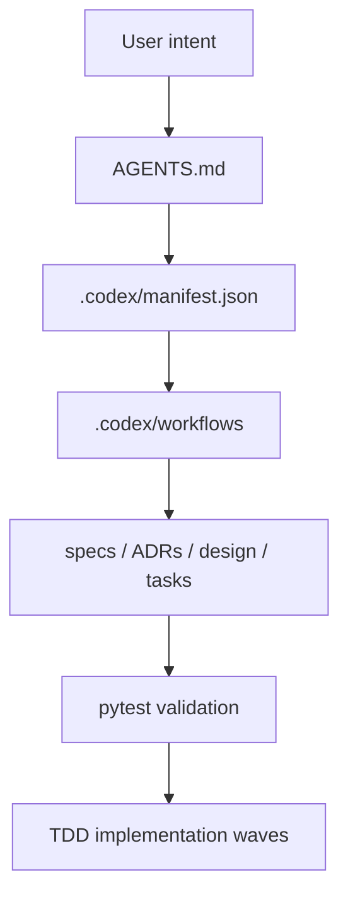

# Codex LAM Replacement Design

Status: Draft for review
Date: 2026-04-30

## Overview

Codex LAM replaces Claude-specific runtime controls with a visible file contract
and executable validation.

## Components

### AGENTS.md

Primary instruction file for Codex. It defines identity, truth hierarchy,
phases, approval gates, and review protocol.

### `.codex/manifest.json`

Machine-readable contract for the active harness. It intentionally names Codex
as the runtime and `.codex` as the source harness.

### `.codex/workflows/`

Human-readable phase workflows:

- `planning.md`
- `building.md`
- `auditing.md`

### `codex_lam/manifest.py`

Small validation module used by tests. It rejects Claude runtime declarations,
missing gates, unexpected phase lists, and missing declared documents.

### Planning Documents

The replacement is reviewed through:

- requirements: `docs/specs/codex-lam-replacement-requirements.md`
- ADR: `docs/adr/0005-codex-native-harness.md`
- design: `docs/design/codex-lam-replacement-design.md`
- tasks: `docs/tasks/codex-lam-replacement-tasks.md`

## TDD Strategy

The first Red test is `tests/test_codex_manifest.py`. It encodes the minimal
observable contract for the replacement before implementation.

The first Green implementation adds:

- `codex_lam/manifest.py`
- `AGENTS.md`
- `.codex/manifest.json`
- `.codex/workflows/`
- planning artifacts

Refactor work should happen only after tests pass.

## Migration Strategy

Wave 1 creates the Codex harness next to the legacy Claude harness.

Wave 2 ports useful, runtime-independent Claude logic into Codex-compatible
validation scripts and tests.

Wave 3 deprecates or archives Claude-only material after review.

## Risk Controls

- No destructive deletion in Wave 1.
- Manifest tests prevent accidentally pointing Codex back to Claude runtime.
- Approval gates remain explicit even though they are no longer implemented as
  Claude slash command hooks.
