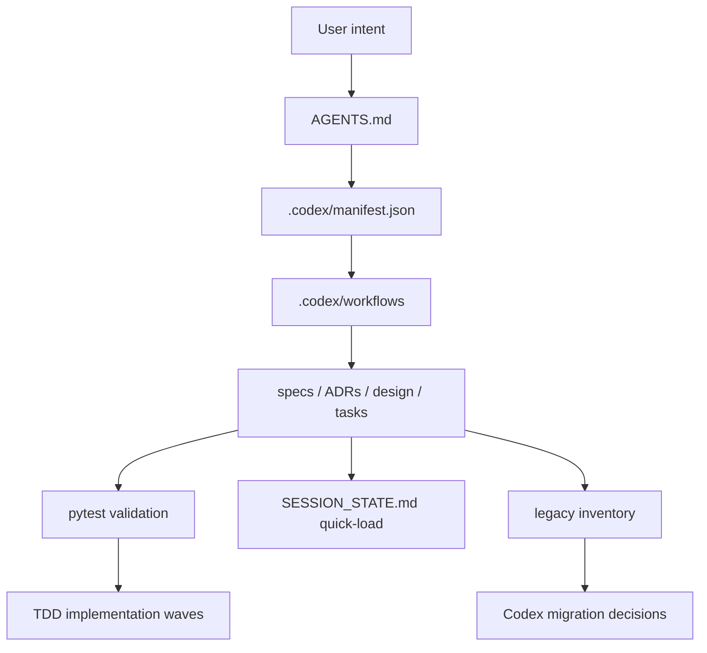

# Codex LAM 置き換え設計

Status: Accepted
Date: 2026-04-30

## Overview

Codex LAM は、Claude Code 固有の runtime controls を、Codex で読める file contract、明示的な workflow、実行可能な検証へ置き換える。

## Components

### `AGENTS.md`

Codex の主要な instruction file。
役割、権威順位、フェーズ、承認ゲート、レビュー方針、ローカル運用メモを定義する。

### `.codex/manifest.json`

有効な Codex harness contract を表す machine-readable file。
`runtime` は `codex`、`source_harness` は `.codex` とする。

manifest は `PLANNING`、`BUILDING`、`AUDITING` の phase list と、requirements、design、tasks、building、auditing の approval gate list を持つ。
また、Codex harness を構成する required documents を列挙する。

### `.codex/workflows/`

人間が読める phase workflow を置く。

- `planning.md`
- `building.md`
- `auditing.md`

加えて、日常運用の補助 workflow として以下を置いてよい。

- `quick-load.md`
- `quick-save.md`

各 workflow は、フェーズの目的、必要な入力、主な手順、禁止事項または注意点、次の承認ゲートとの関係を説明する。
補助 workflow は、`SESSION_STATE.md` を使った軽量 handoff / resume 手順を短く定義する。

### `codex_lam/manifest.py`

manifest validation のための小さな Python module。
少なくとも以下を検証する。

- `runtime` が `codex` であること。
- `source_harness` が `.codex` であること。
- phase list が不足、重複、順序違い、大文字小文字違いを起こしていないこと。
- approval gate list が不足、重複、順序違い、大文字小文字違いを起こしていないこと。
- manifest が列挙する documents が存在すること。

### `SESSION_STATE.md`

手動 quick-load/save のための最短復元メモ。
Git では通常共有しないため、別PCで継続する場合は共有フォルダなどで手動同期する。

保存する内容は、現在フェーズ、branch/remote、完了済み作業、進行中作業、次の手順、主要ファイル、環境注意点、直近の検証結果とする。

### Planning Documents

置き換えは以下の planning artifacts でレビューする。

- requirements: `docs/specs/codex-lam-replacement-requirements.md`
- ADR: `docs/adr/0005-codex-native-harness.md`
- design: `docs/design/codex-lam-replacement-design.md`
- tasks: `docs/tasks/codex-lam-replacement-tasks.md`

### Legacy Inventory

`.claude/` 配下の既存資産と、旧 `docs/` 配下に残る設計知見を棚卸しするための作業単位。
対象は少なくとも以下とする。

- `.claude/commands/`
- `.claude/hooks/`
- `.claude/agents/` または subagent 定義
- `.claude/settings.json`
- rules、guides、checklists、運用メモ
- 旧 `docs/specs/`
- 旧 `docs/adr/`
- 旧 `docs/design/`
- 旧 `docs/internal/`

棚卸し結果は、Codex へ移設、Codex-native workflow/CLI/pytest/review procedure として再実装、legacy 参考資料として維持、Claude-only runtime glue として非推奨化、のいずれかに分類する。

## Migration Strategy

### Wave 1: Codex contract scaffold

Codex harness を legacy Claude harness の隣に作る。

この wave では、`AGENTS.md`、`.codex/manifest.json`、`.codex/workflows/`、planning documents、manifest validation tests を用意する。
legacy file の破壊的削除はしない。

### Wave 2: Harness behavior migration

`.claude/` 配下の rules、commands、hooks、agents/subagents、settings、guides、checklists、運用メモを棚卸しする。
あわせて、旧 `docs/specs/`、`docs/adr/`、`docs/design/`、`docs/internal/` に残る設計知見も棚卸しする。

Codex で安全かつ自然に対応できるものは、以下のいずれかへ移す。

- `AGENTS.md` または `.codex/constitution.md`
- `.codex/workflows/`
- Codex-compatible CLI
- pytest helper
- review procedure
- task generation guidance
- migration notes

Wave 2C の item-by-item classification は、`docs/migration/claude-legacy-inventory.md`
と `docs/migration/claude-to-codex-migration-notes.md` を primary record として残す。

`.claude/agents/` や subagent 定義は、原則として役割別レビュー観点、作業手順、workflow、または task generation guidance として文書化する。
ただし、design または tasks を作る時点で、各 agent/subagent ごとの扱いを個別確認する。

旧 docs 由来の設計知見は、`docs/migration/codex-reusable-legacy-docs.md`、`docs/migration/legacy-harvest-notes.md`、`docs/migration/legacy-harvest-decision.md` を入口として扱う。
採用候補は baseline、Wave 2C の個別判断、Wave 3 以降または別 ADR、Claude-only/archive のいずれかへ分類する。

### Wave 3: Legacy cleanup

Codex parity がレビューされ、移設対象と非推奨対象が明確になったあとで、Claude-only material を archive または削除する。

README、quickstart、cheatsheet、slides の文面と導線は Wave 2E R6 で Codex App 前提へ更新した。
この wave では R6 後に残った Claude 前提の表現や migration notes の不整合だけを修正する。
README / HTML slides の画像・visual onboarding は R6 完了範囲に含めず、配布仕上げ gate の未完了タスクとして扱う。

## TDD Strategy

最初の Red test は `tests/test_codex_manifest.py` とする。
この test は Codex harness の最小 observable contract を検証する。

Wave 2 では、requirements の FR-5 に合わせて test matrix を拡張する。

- `runtime` が `codex` ではない場合に失敗する。
- `source_harness` が `.codex` ではない場合に失敗する。
- phase list の不足、重複、順序違い、大文字小文字違いで失敗する。
- approval gate list の不足、重複、順序違い、大文字小文字違いで失敗する。
- required document が存在しない場合に失敗する。
- required workflow が存在しない場合に失敗する。

quick-load は、当面は手動 workflow として扱う。
`SESSION_STATE.md` の必須項目は review で確認し、必要になった時点で pytest helper または CLI validation へ移す。

permission-level classification も同様に、Wave 2C では migration note と workflow guidance に再表現する。
standalone validator や helper へ切り出す判断は、この wave では defer とし、必要になった時点で別の design review を通してから実装する。

TDD introspection は BUILDING の必須 gate にせず、optional helper candidate として
`docs/specs/feat-tdd-introspection-helper.md` を入口に段階導入する。
初手は Codex-native CLI を先行し、pytest helper は後続候補として扱う。
この wave では `docs/artifacts/tdd-introspection-records.log` への記録と、
read-only な `summary` 表示までを最小範囲とする。

## Risk Controls

- Wave 1 では legacy file を破壊的に削除しない。
- `.claude/` は Codex runtime source として扱わない。
- legacy asset を移設しない場合は、理由を design、tasks、または migration notes に残す。
- 旧 docs 由来の知見は、実装手段ではなく Codex-native に再表現できる判断原理だけを採用候補にする。
- approval gates は Claude slash command hook ではなく、Codex の明示的なレビューとユーザー承認で運用する。
- 日本語で書ける project-facing documentation は日本語を基本にする。
- Windows 環境では pytest temp directory の ACL 問題がありうるため、docs-only change では pytest を省略できる。
