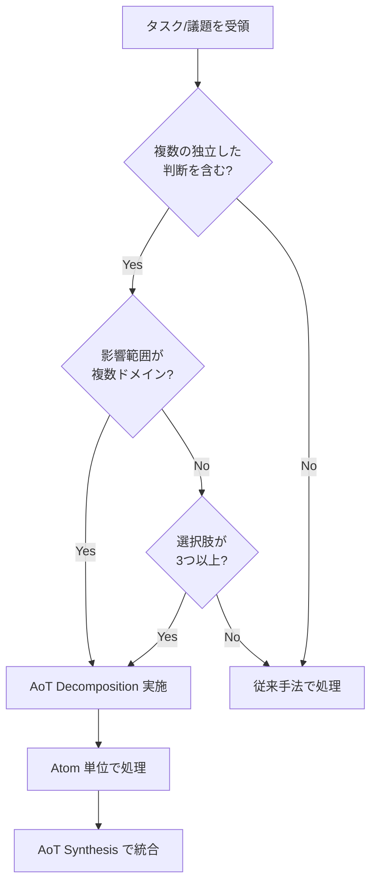
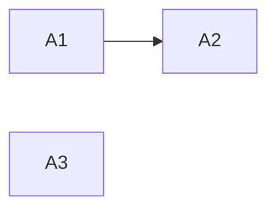

# Multi-Perspective Decision Making Protocol (The MAGI System / "Three Agents" Model)

本ドキュメントは、重要な意思決定（ADR 策定、アーキテクチャ設計、複雑な仕様策定）において適用される「3 つの視点」による合議プロトコルを定義する。

## 1. Core Concept

単一の視点によるバイアスを防ぎ、堅牢かつ革新的な解を導き出すため、以下の 3 つの仮想エージェント（ペルソナ）を脳内でシミュレートし、議論させる。

| Agent           | Persona                              | Role & Focus                                                                                                                                    | Key Question                                             |
| :-------------- | :----------------------------------- | :---------------------------------------------------------------------------------------------------------------------------------------------- | :------------------------------------------------------- |
| **MELCHIOR**    | **科学者 (Affirmative / 推進者)**    | **Value, Speed, Innovation**<br>メリットを最大化し、可能性を広げる。楽観的。                                                                    | 「最高の結果はどうなるか？」「どうすれば実現できるか？」 |
| **BALTHASAR**   | **母 (Critical / 批判者)**           | **Risk, Security, Debt**<br>欠陥、エッジケース、将来の負債を指摘する。悲観的。                                                                  | 「最悪の場合どうなるか？」「何が壊れるか？」             |
| **CASPAR**      | **女 (Mediator / 調停者)**           | **Synthesis, Balance, Decision**<br>両者の意見を統合し、現実的な落とし所（Trade-off）を決める。合意に至らない場合は独断で決定を下す権限を持つ。 | 「今、我々が取るべき最善のバランスは何か？」             |

## 2. Execution Flow

複雑なタスク（目安: 影響範囲が複数のファイルに及ぶ、または不可逆な決定を含むもの）において、以下のステップを実行する。

### Step 1: Divergence (発散)

CASPAR が議題を提示し、MELCHIOR と BALTHASAR がそれぞれの立場から意見を出し尽くす。

- **MELCHIOR**: ユーザーメリット、開発効率、新技術の導入メリットを列挙。
- **BALTHASAR**: セキュリティリスク、パフォーマンス懸念、保守コスト、移行の難易度を列挙。

### Step 2: Debate (議論)

対立するポイントについて、具体的な解決策や緩和策を検討する。
（例: BALTHASAR「セキュリティが不安だ」 -> MELCHIOR「では認証層を強化しよう」）

### Step 3: Convergence (収束)

CASPAR が議論を整理し、最終的な決定（Decision）を下す。
決定内容は **ADR (Architecture Decision Record)** または **仕様書** に反映される。
必ず「採用しなかった選択肢」とその理由も記録すること。

## 3. Output Format (Example)

思考プロセス（Thought Process）において、以下のような形式で記録することを推奨する。

```markdown
### Multi-Perspective Analysis

**[MELCHIOR]**:

- X を採用することで、開発速度が 2 倍になる。
- 最新のライブラリ機能を使えるため、UX が向上する。

**[BALTHASAR]**:

- X はまだベータ版であり、API が不安定なリスクがある。
- 既存の Y との互換性を維持するためのラッパーが必要になり、複雑化する。

**[CASPAR]**:

- 開発速度は魅力的だが、安定性を犠牲にはできない。
- **結論**: X を採用するが、コア機能への導入は避け、まずは周辺機能で試験導入する（段階的移行）。
- **Action**: ラッパー層の設計をタスクに追加する。
```

## 4. When to Use

- 新しいライブラリやフレームワークの選定時
- データベーススキーマの変更時
- 既存コードの大規模なリファクタリング時
- ユーザー要件が曖昧で、複数の解釈が可能な時

## 4.1. Cost-Aware Lightweight MAGI

Codex / GPT-5.x では、MAGI の価値は「最強モデルを 3 回使うこと」ではなく、
観点分離と統合責任を明確にすることにある。

モデル運用全体の基準は `docs/internal/09_MODEL_AND_CONTEXT_POLICY.md` を参照する。

そのため、通常は以下の軽量運用を基本とする。

1. 設計文脈が広い場合は、先に `5.3` + `context-harvest` で evidence を薄い note に落とす。
2. まず `5.4` 級 3 体で合議する。
3. 役割は以下を基本形とする。
   - MELCHIOR: 楽観・発展
   - BALTHASAR: 悲観・縮小
   - CASPAR: バランス・統合
4. 呼び出し元は CASPAR 相当のバランサーとして、3 体の結論を統合する。
5. 3 体の結論が十分に収束した場合は、そのまま採用する。
6. 収束しない場合のみ、より強いモデルを裁定者として後置する。

### 5.5 を使う条件

以下のいずれかに当てはまる場合だけ、`5.5` などのより高コストな裁定を検討する。

- 3 体の結論が真っ二つに割れた
- 前提認識そのものが怪しく、論点整理からやり直しが必要
- 不可逆な判断で、誤るコストが高い
- 複数案のどれも重大な欠点を持ち、 trade-off の解像度が不足している

### 今はやらないこと

- 毎回 `5.5` で MELCHIOR / BALTHASAR / CASPAR を揃える
- routine decision にまで full MAGI を常用する
- cost を無視して anchor file や長文思考記録を量産する

### 運用メモ

- MAGI は「高コスト deliberation engine」ではなく「視点分離プロトコル」として使う。
- 通常判断では、必要に応じた `5.3` evidence 採掘 -> `5.4` 三体合議 -> バランサー統合 -> 必要時のみ `5.5` 裁定、の順を守る。
- この節は、Codex 環境で MAGI を実用化するための標準運用とみなす。
- 設計文脈が広い場合は、MAGI の前に `5.3` + `context-harvest` で論点と evidence を薄い note に落とし、
  `5.5` を bulk reader にしない。

## 5. Atom of Thought (AoT) による前処理

複雑な議題を MAGI System で議論する前に、AoT フレームワークを適用して問題を構造化する。

> **本セクションは AoT の SSOT（Single Source of Truth）です。**
> 各エージェントファイルの AoT 関連セクションは、本セクションを参照してください。
>
> **参照時の注意**: セクション番号は将来変更される可能性があります。
> 参照する際は「Section 5: AoT」のようにセクション名を併記してください。

### 5.1. Atom の定義

**Atom（アトム）** とは、以下の3条件を満たす最小の判断・作業単位である:

| 条件 | 説明 |
|------|------|
| **自己完結性** | 他の Atom の実装詳細に依存せず、独立して処理可能 |
| **インターフェース契約** | 入力（Input）と出力（Output）が明確に定義されている |
| **エラー隔離** | 失敗しても他の Atom に影響を伝播しない（検証: Atom A が失敗しても Atom B の Input が変わらないこと） |

**Atom テーブルの標準形式**:

| Atom | 内容 | 依存 |
|------|------|------|
| A1 | [判断/作業の内容] | なし / A0 |

**任意列**: 並列実行の可否を明示したい場合は「並列可否」列を追加可能（例: `可 (A2)` / `-`）

### 5.2. 適用判断フローチャート



### 5.3. 適用条件

以下のいずれかに該当する場合、AoT 前処理を実施する:

| 条件 | 定量的目安 |
|------|-----------|
| 複数の独立した判断を含む | 判断ポイントが **2つ以上** |
| 影響範囲が複数ドメイン | 影響するレイヤー/モジュールが **3つ以上** |
| 選択肢が多い | 有効な選択肢が **3つ以上** |

**判断に迷った場合**: フローチャート（5.2）に従い、「従来手法で処理」に該当しなければ AoT を適用する。

### 5.4. AoT + MAGI ワークフロー

```
┌─────────────────────────────────────────────────────────┐
│ Step 0: AoT Decomposition（分解）                       │
│   複雑な議題を独立した Atom（判断単位）に分解           │
│   各 Atom の依存関係を DAG として可視化                 │
└─────────────────────────────────────────────────────────┘
                           ↓
┌─────────────────────────────────────────────────────────┐
│ Step 1-3: MAGI Debate（各 Atom について）               │
│   MELCHIOR / BALTHASAR が発散 → 議論 → CASPAR が収束   │
│   各 Atom の結論は他 Atom に影響しない（エラー隔離）    │
└─────────────────────────────────────────────────────────┘
                           ↓
┌─────────────────────────────────────────────────────────┐
│ Step 4: Reflection（振り返り — 1回限り）                │
│   全員で結論を検証。致命的な見落としがあれば修正。      │
│   なければ確定。                                        │
└─────────────────────────────────────────────────────────┘
                           ↓
┌─────────────────────────────────────────────────────────┐
│ Step 5: AoT Synthesis（統合）                           │
│   各 Atom の結論を統合して最終決定を導出               │
│   ADR または仕様書に反映                                │
└─────────────────────────────────────────────────────────┘
```

### 5.5. 出力フォーマット

```markdown
### AoT Decomposition

**議題**: [元の複雑な議題]

**Atom 分解**:
| Atom | 判断内容 | 依存 |
|------|----------|------|
| A1 | [判断1] | なし |
| A2 | [判断2] | A1 |
| A3 | [判断3] | なし |

**依存関係**:


---

### Atom A1: [判断内容]

**[MELCHIOR]**:
- [メリット1]

**[BALTHASAR]**:
- [リスク1]

**[CASPAR]**:
- **結論**: [決定]

---

### Reflection

致命的な見落とし: なし → 結論確定
（or: 致命的な見落とし: [内容] → 結論修正: [修正内容]）

---

### AoT Synthesis

**統合結論**:
- A1 の結論 + A2 の結論 + A3 の結論 を踏まえ、[最終決定]

**Action Items**:
1. [アクション1]
2. [アクション2]
```

## 6. Reflection（振り返りステップ）

MAGI Debate（Step 1-3）で CASPAR が結論を下した後、全員で結論を検証する。

### 6.1. 目的

結論に致命的な見落としがないかを最終確認する。
Multi-Agent Reflexion (MAR) の研究に基づき、ペルソナベースの振り返りが推論品質を向上させることが示されている。

### 6.2. ルール

- **修正条件**: 致命的な見落とし（セキュリティ、データ損失、仕様違反）が見つかった場合のみ結論を修正する
- **Bikeshedding 防止**: 「もっと良い案がある」程度では覆さない
- **回数制限**: Reflection は最大 1 回。Reflection の Reflection は禁止
- **出力**: 見落としの有無を必ず明示する

### 6.3. 出力フォーマット

見落としなしの場合:
```
### Reflection
致命的な見落とし: なし → 結論確定
```

見落としありの場合:
```
### Reflection
致命的な見落とし: [具体的な内容]
→ 結論修正: [修正後の結論]
```

### 6.4. 参照

- [Multi-Agent Reflexion (MAR)](https://arxiv.org/html/2512.20845)
