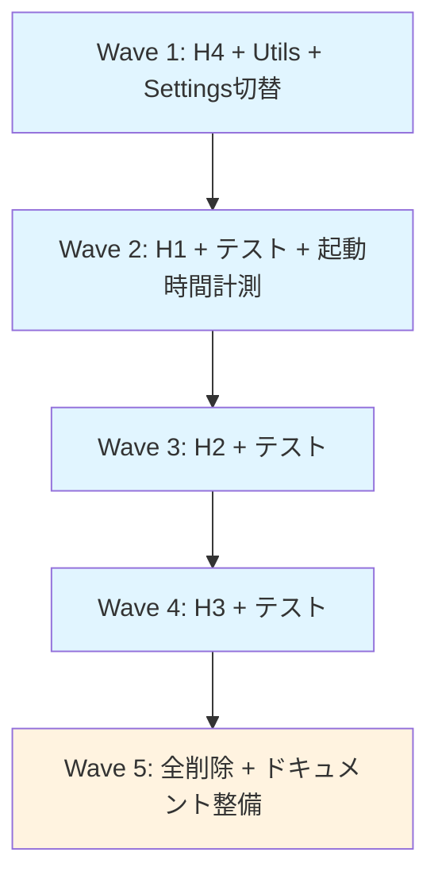

# タスク分解: フックスクリプト Python 一本化

**プロジェクト**: Living Architect Model
**対象**: Wave 1〜5（全フックの bash → Python 移行）— 全 32 タスク
**作成日**: 2026-03-10
**参照仕様**:
- `requirements.md` (FR/NFR/AC定義)
- `design.md` (Wave構成・テスト対応表)

---

## 全体構成



---

## Wave 1: H4 (pre-compact) + _hook_utils.py + 初期セットアップ

**目標**: 最小フック（42行）で Python 基盤を確立。共通ユーティリティを実装し、H4 を実動作確認する。

### W1-T1: _hook_utils.py の実装

**タスク ID**: W1-T1
**分類**: TDD (Red → Green → Refactor)

**概要**:
共通ユーティリティモジュール `_hook_utils.py` を実装。10個の関数を含む。
標準ライブラリ（json, sys, os, pathlib, tempfile, datetime, shutil, subprocess）のみ使用。

**対応仕様**:
- `design.md` Section 2 (共通ユーティリティ設計)
- `requirements.md` FR-2 (jq 依存除去), FR-3 (クロスプラットフォーム)

**完了条件**:
- [x] `_hook_utils.py` ファイルが存在
- [x] 10関数全て実装: `get_project_root()`, `read_stdin_json()`, `get_tool_name()`, `get_tool_input()`, `get_tool_response()`, `normalize_path()`, `log_entry()`, `atomic_write_json()`, `run_command()`, `safe_exit()`
- [x] `get_project_root()`: 環境変数 `LAM_PROJECT_ROOT` が設定されていれば優先（テスト用オーバーライド）
- [x] 標準ライブラリのみ依存（外部パッケージなし）
- [x] シバン行 `#!/usr/bin/env python3` なし（ユーティリティモジュールのため）
- [x] Windows パス対応: `pathlib.Path` 一貫使用
- [x] アトミック書き込み: `tempfile(dir=対象と同ディレクトリ) + os.replace` + exponential backoff retry (3回, 100ms/200ms/400ms)
- [x] 型ヒント: Python 3.8 互換（`Optional[X]` 記法、`from __future__ import annotations` 使用可）

**依存**: なし

**推定規模**: M (200行程度)

---

### W1-T2: pre-compact.py の実装

**タスク ID**: W1-T2
**分類**: TDD (Red → Green → Refactor)

**概要**:
H4: `pre-compact.py` を実装。コンテキスト圧縮前の状態保存を行う最小フック。
`_hook_utils.py` を import し、42行の bash スクリプトを 30-40行の Python コードに変換。

**対応仕様**:
- `design.md` Section 3.4 (H4設計)
- `requirements.md` FR-1 (パリティ), FR-4 (エラー耐性)

**完了条件**:
- [x] `pre-compact.py` ファイルが存在
- [x] シバン行 `#!/usr/bin/env python3` あり
- [x] stdin JSON 読み込み不要（使用しない入力を自動ignore）
- [x] フロー全実装:
  - [x] PreCompact 発火フラグ書き込み（タイムスタンプ ISO 8601）
  - [x] SESSION_STATE.md への記録（冪等処理）
  - [x] lam-loop-state.json のバックアップ
- [x] エラー耐性: 常に exit 0（圧縮をブロックしない）
- [x] Windows パス対応: `pathlib.Path` 使用
- [x] ファイル書き込み失敗時も回復（try-except で safe_exit）
- [x] bash 版と同一の副作用（ファイル名・フォーマット一致）
- [x] 実行権限付与: `chmod +x`（shebang 直接実行対応）

**依存**: W1-T1 (_hook_utils.py)

**推定規模**: S (40行)

---

### W1-T2a: test_hook_utils.py（共通ユーティリティのユニットテスト）

**タスク ID**: W1-T2a
**分類**: TDD (Red → Green)

**概要**:
`_hook_utils.py` の主要関数に対するユニットテスト。基盤モジュールのバグは全フックに波及するため、
Wave 1 の段階で検証する。conftest.py は不要（直接 import でテスト可能）。
import パス解決: テストファイル冒頭で `sys.path.insert(0, os.path.join(os.path.dirname(__file__), '..'))` を使用し、`_hook_utils` を import する。

**対応仕様**:
- `design.md` Section 2 (共通ユーティリティ設計)
- `requirements.md` FR-2 (jq 依存除去), FR-3 (クロスプラットフォーム)

**完了条件**:
- [x] `tests/__init__.py` ファイルが存在（空ファイル、pytest パッケージ認識用）
- [x] `tests/test_hook_utils.py` ファイルが存在
- [x] テストケース:
  - [x] `test_get_project_root_default`: `__file__` ベースの PROJECT_ROOT 取得
  - [x] `test_get_project_root_env_override`: `LAM_PROJECT_ROOT` 環境変数でのオーバーライド
  - [x] `test_read_stdin_json_valid`: 正常な JSON 入力
  - [x] `test_read_stdin_json_invalid`: 不正入力 → 空 dict
  - [x] `test_normalize_path_absolute`: 絶対パス → 相対パス変換
  - [x] `test_normalize_path_relative`: 相対パスはそのまま
  - [x] `test_atomic_write_json`: JSON のアトミック書き込み + 読み戻し検証
  - [x] `test_log_entry`: TSV ログ追記
  - [x] `test_safe_exit`: exit code の検証
- [x] `pytest .claude/hooks/tests/test_hook_utils.py -v` で全 PASS
- [x] 外部パッケージ不要（pytest のみ）

**依存**: W1-T1 (_hook_utils.py)

**推定規模**: S (80行程度)

---

### W1-T3: pre-compact.py の手動パリティ確認

**タスク ID**: W1-T3
**分類**: テスト（Black-box検証）

**概要**:
H4 の Python 版が bash 版と同一出力を返すことを確認。
bash 版と Python 版を並行実行し、副作用（ファイル作成・更新）を比較。

**対応仕様**:
- `design.md` Section 5 (パリティ検証の定義)
- `requirements.md` AC-1, AC-3

**完了条件**:
- [x] テスト環境セットアップ:
  - [x] テンポラリプロジェクトディレクトリ作成
  - [x] `.claude/logs/`, `.claude/` ディレクトリ作成
- [x] 複数ケース実行:
  - [x] 正常系: 入力 `{}` → exit 0 + ファイル作成
  - [x] SESSION_STATE.md 既存時: 重複エントリなし（上書き）
  - [x] lam-loop-state.json 既存時: バックアップ作成
- [x] bash 版との出力比較:
  - [x] exit code 一致
  - [x] ファイル名・フォーマット一致
  - [x] タイムスタンプ形式（ISO 8601）一致
- [x] ドキュメント: テスト結果を `.claude/states/hooks-python-migration.json` に記録

**依存**: W1-T2 (pre-compact.py)

**推定規模**: M (2時間程度の手動検証)

---

### W1-T4: settings.json を H4 のみ .py に切替

**タスク ID**: W1-T4
**分類**: 設定変更（PM級）

**概要**:
`.claude/settings.json` の PreCompact フック設定を `.sh` から `.py` に変更。
他の3フック（H1, H2, H3）は .sh のままの状態を維持。

**対応仕様**:
- `design.md` Section 7 (settings.json 変更計画)
- `requirements.md` FR-5

**完了条件**:
- [x] 方式 A（python3 明示呼び出し）で設定:
```json
{
  "PreCompact": [
    {
      "hooks": [
        {
          "type": "command",
          "command": "python3 \"$CLAUDE_PROJECT_DIR\"/.claude/hooks/pre-compact.py"
        }
      ]
    }
  ]
}
```
- [x] 方式 B（shebang 直接実行）も動作することを検証:
```json
{
  "PreCompact": [
    {
      "hooks": [
        {
          "type": "command",
          "command": "\"$CLAUDE_PROJECT_DIR\"/.claude/hooks/pre-compact.py"
        }
      ]
    }
  ]
}
```
- [x] 動作確認後、方式 A を採用（方式 B は Windows フォールバックとして QUICKSTART に記載）
- [x] 他の PreToolUse, PostToolUse, Stop は `.sh` のまま → 全フック一括で .py に切替済み
- [x] JSON 形式が有効（jq or Python json で validate）

**依存**: W1-T2 (pre-compact.py)

**推定規模**: S (設定変更のみ)

---

### W1-T5: Claude Code 実動作確認（H4 切替）

**タスク ID**: W1-T5
**分類**: 手動検証（Definition of Ready）

**概要**:
Wave 1 完了後、Claude Code でフックが正常動作することを確認。
コンテキスト圧縮ブロックが発生しないこと、ログが正常に記録されることを検証。

**対応仕様**:
- `design.md` Section 5 (Wave ごとの完了条件)
- `requirements.md` AC-3

**完了条件**:
- [x] Claude Code の `.claude/settings.json` を新版に反映
- [x] Claude Code を再起動（フック設定の再読み込み）
- [x] 通常操作（Read → Edit など）を複数回実施
- [x] コンテキスト圧縮が発火しないこと（PreCompact hook が正常実行されていることを確認）
- [x] `.claude/pre-compact-fired` ファイルが作成されていることを確認
- [x] `.claude/logs/` にログが記録されていることを確認
- [x] エラー、例外が発生していないこと

**依存**: W1-T4 (settings.json 切替)

**推定規模**: S (手動検証 30分程度)

---

## Wave 2: H1 (pre-tool-use) + テスト + 起動時間計測

**目標**: 最頻フック H1 を Python 化。テストスイート（pytest + conftest.py）を確立。
NFR-1（パフォーマンス）を実測確認する。

### W2-T1: conftest.py（共通 pytest fixtures）の実装

**タスク ID**: W2-T1
**分類**: TDD (Red → Green)

**概要**:
pytest フレームワークの基盤となる `tests/conftest.py` を実装。
フック実行ヘルパー、テンポラリファイルシステム、クリーンアップロジックを定義。

**対応仕様**:
- `design.md` Section 4 (テスト設計)
- `requirements.md` FR-6 (テストフレームワーク)

**完了条件**:
- [x] `tests/conftest.py` ファイルが存在
- [x] 3つ以上の fixtures 定義:
  - [x] `project_root(tmp_path)`: テンポラリプロジェクトルート作成
  - [x] `hook_runner(project_root)`: フック subprocess 実行ヘルパー
  - [x] `cleanup_files(project_root)`: → tmp_path 自動クリーンアップで不要と判断、削除済み
- [x] `run_hook()` ヘルパー関数:
  - [x] subprocess.run で `sys.executable` フック実行（python3 ハードコード回避）
  - [x] stdin JSON 入力対応
  - [x] stdout, stderr, exit code 返却
  - [x] タイムアウト 30秒設定
  - [x] `env` パラメータで `LAM_PROJECT_ROOT` を `tmp_path` に設定（実プロジェクト汚染防止）
- [x] Windows/Linux 両対応（pathlib.Path 使用）
- [x] `tests/__init__.py` 存在確認（W1-T2a で作成済み）

**依存**: なし（技術的依存なし。Wave ゲートとして W1-T5 完了後に開始）

**推定規模**: S (100行程度)

---

### W2-T2: test_pre_tool_use.py（テスト実装）

**タスク ID**: W2-T2
**分類**: TDD (Red)

**概要**:
H1 の pytest テストスイート `tests/test_pre_tool_use.py` を実装。
bash 版 `test-pre-tool-use.sh` の全テストケース（TC-2〜TC-7）を pytest に移植。

**対応仕様**:
- `design.md` Section 4 (テストケース対応表 TC-2〜TC-7)
- `requirements.md` FR-1 (パリティ), AC-2

**完了条件**:
- [x] `tests/test_pre_tool_use.py` ファイルが存在
- [x] テストケース実装（8個、設計書 TC-2〜TC-7 の6個 + 追加2個）:
  - [x] `test_read_tool_pg_allow`: Read ツール → PG 許可（exit 0）（TC-2）
  - [x] `test_edit_specs_pm_ask`: Edit docs/specs/ → PM ask（承認ダイアログ）（TC-3）※deny→ask に変更（PM承認済み）
  - [x] `test_edit_rules_auto_generated_pm_ask`: Edit .claude/rules/auto-generated/ → PM ask（TC-4）※deny→ask に変更
  - [x] `test_absolute_path_normalization`: 絶対パス → 相対パス正規化（TC-5）
  - [x] `test_edit_src_se_allow`: Edit src/ → SE 許可（exit 0）（TC-6）
  - [x] `test_log_truncation`: ログメッセージが 100 文字で trunc される（TC-7）
  - [x] `test_glob_tool_pg_allow`: Glob ツール → PG 許可（追加）
  - [x] `test_grep_tool_pg_allow`: Grep ツール → PG 許可（追加）
- [x] TDD Red: 実装前にスケルトン `pre-tool-use.py`（`exit 0` のみ）を作成し、テストが意味のある失敗をすることを確認
- [x] 各テストが conftest.py の fixtures を使用
- [x] JSON 入出力の検証（json.loads で decode）
- [x] ログファイル副作用の検証（ファイルが期待通り作成・追記される）
- [x] Windows パス対応（`PurePosixPath` 正規化等）

**依存**: W2-T1 (conftest.py)

**推定規模**: M (150行程度)

---

### W2-T3: pre-tool-use.py の実装

**タスク ID**: W2-T3
**分類**: TDD (Green → Refactor)

**概要**:
H1: `pre-tool-use.py` を実装。権限等級判定ロジック（PG/SE/PM）を Python で再構築。
bash 版 163行 → Python で 120-150行に短縮。jq 依存を除去。

**対応仕様**:
- `design.md` Section 3.1 (H1設計)
- `requirements.md` FR-1, FR-2, FR-3, FR-4

**完了条件**:
- [x] `pre-tool-use.py` ファイルが存在
- [x] シバン行 `#!/usr/bin/env python3` あり
- [x] 実装フロー:
  - [x] stdin から JSON 読み込み（read_stdin_json）
  - [x] tool_name 抽出
  - [x] Read/Glob/Grep/WebSearch/WebFetch → PG 判定
  - [x] file_path/command を抽出
  - [x] normalize_path() でパス正規化（絶対→相対）
  - [x] 正規表現パターンマッチ: docs/specs/, .claude/rules/auto-generated/, src/, docs/, その他
  - [x] AUDITING フェーズの PG 級コマンド特別処理（PHASE_FILE を読み込み）
  - [x] ログ記録（log_entry）: timestamp, level, source, message（100文字 trunc）
  - [x] PM 級判定時: ask JSON を stdout に出力、exit 0 ※deny→ask に変更（PM承認済み）
  - [x] その他: exit 0（許可）
- [x] エラー耐性: `try-except Exception` で全体をラップ + `finally` ブロック、例外時は exit 0
- [x] Windows パス対応: `pathlib.Path` + `PurePosixPath` 正規化
- [x] bash 版との完全パリティ（テストで検証）
- [x] 実行権限付与: `chmod +x`

**依存**: W1-T1 (_hook_utils.py), W2-T1 (conftest.py), W2-T2 (test_pre_tool_use.py)

**推定規模**: M (150行)

---

### W2-T4: W2-T2 テスト全 PASS 確認

**タスク ID**: W2-T4
**分類**: TDD (Green)

**概要**:
`pytest .claude/hooks/tests/test_pre_tool_use.py` を実行。全 8 テストが PASS することを確認。
W2-T2 で作成したテストが W2-T3 で実装した `pre-tool-use.py` に対して green になることを検証。

**対応仕様**:
- `design.md` Section 5 (Wave ごとの完了条件)
- `requirements.md` AC-2

**完了条件**:
- [x] テスト実行コマンド: `pytest .claude/hooks/tests/test_pre_tool_use.py -v`
- [x] 全 8 テストが PASS
- [x] カバレッジ: `pre-tool-use.py` の主要分岐が全て通る
- [x] エラーメッセージなし
- [x] ドキュメント: テスト結果を `.claude/states/hooks-python-migration.json` に記録

**依存**: W2-T2 (テスト実装), W2-T3 (実装)

**推定規模**: S (自動テスト 5分程度)

---

### W2-T5: pre-tool-use.py の起動時間計測

**タスク ID**: W2-T5
**分類**: パフォーマンス検証（NFR-1）

**概要**:
`time python3 .claude/hooks/pre-tool-use.py < test.json` で起動時間を計測。
目安値 500ms 以内であることを確認し、Python オーバーヘッドが許容範囲であることを実測。

**対応仕様**:
- `requirements.md` NFR-1 (パフォーマンス)
- `design.md` Section 5 (Wave 2 追加条件)

**完了条件**:
- [x] テストデータ作成: 標準的な tool_input JSON（500 bytes 程度）
- [x] 計測方法（以下のいずれか）:
  - [ ] 推奨: `hyperfine 'python3 .claude/hooks/pre-tool-use.py < test.json' --warmup 3 --runs 10`
  - [x] フォールバック: `time` コマンドで 10回以上実行し、中央値と95パーセンタイルを報告
- [ ] import プロファイル: `python3 -X importtime .claude/hooks/pre-tool-use.py < test.json 2> importtime.log` でボトルネック import を特定
- [x] 中央値が 500ms 以内（リアルタイム）
- [ ] 計測結果をドキュメント記録: `docs/memos/performance-baseline.md` に追記
- [ ] 計測環境を記録（OS, Python 版, マシンスペック等）

**依存**: W2-T3 (pre-tool-use.py)

**推定規模**: S (計測・ドキュメント 1時間)

---

### W2-T6: settings.json を H1 のみ .py に切替（累積）

**タスク ID**: W2-T6
**分類**: 設定変更（PM級）

**概要**:
`.claude/settings.json` の PreToolUse フック設定を `.sh` から `.py` に変更。
Wave 1 で設定した PreCompact は維持。H2, H3 は .sh のままを維持。

**対応仕様**:
- `design.md` Section 7 (settings.json 変更計画)
- `requirements.md` FR-5

**完了条件**:
- [x] 変更内容:
```json
{
  "PreToolUse": [
    {
      "hooks": [
        {
          "type": "command",
          "command": "python3 \"$CLAUDE_PROJECT_DIR\"/.claude/hooks/pre-tool-use.py"
        }
      ]
    }
  ]
}
```
- [x] Wave 1 の PreCompact 設定は維持（累積）
- [x] PostToolUse, Stop は .sh のまま → 全フック一括で .py に切替済み
- [x] JSON 形式が有効

**依存**: W2-T3 (pre-tool-use.py)

**推定規模**: S (設定変更のみ)

---

### W2-T7: Claude Code 実動作確認（H1 切替）

**タスク ID**: W2-T7
**分類**: 手動検証（Definition of Ready）

**概要**:
Wave 2 完了後、Claude Code で H1 フックが正常動作することを確認。
権限等級判定が機能していることを検証。

**対応仕様**:
- `design.md` Section 5 (Wave ごとの完了条件)
- `requirements.md` AC-3

**完了条件**:
- [x] Claude Code の設定を新版に反映
- [x] 権限等級判定テスト（複数操作を実施）:
  - [x] Read ツール（許可）: ファイル読み込み複数回 → ブロックなし
  - [x] Edit docs/specs/ （ask）: 仕様書編集 → 承認ダイアログが表示される ※deny→ask に変更
  - [x] Edit src/ （許可）: ソースコード編集 → 実行許可が得られる
- [x] `.claude/logs/permission.log` が記録されていることを確認
- [x] エラー、例外が発生していないこと

**依存**: W2-T6 (settings.json 切替)

**推定規模**: S (手動検証 30分程度)

---

## Wave 3: H2 (post-tool-use) + テスト

**目標**: TDD パターン検出・doc-sync フラグ・ループログを管理するH2を Python化。
テスト完全移植（T2スイート10テストケース）。

### W3-T1: test_post_tool_use.py（テスト実装）

**タスク ID**: W3-T1
**分類**: TDD (Red)

**概要**:
H2 の pytest テストスイート `tests/test_post_tool_use.py` を実装。
bash 版の 10 テストケース（T1-T10）をすべて pytest に移植。

**対応仕様**:
- `design.md` Section 4 (テストケース対応表 T1-T10)
- `requirements.md` AC-2

**完了条件**:
- [x] `tests/test_post_tool_use.py` ファイルが存在
- [x] テストケース実装（10個、設計書 T1〜T6,T8〜T10 の9個 + 追加1個）:
  - [x] `test_pytest_fail_recorded`: pytest 失敗 → tdd-patterns.log に FAIL 記録（T1）
  - [x] `test_pytest_pass_after_fail`: 失敗後成功 → PASS 記録 + パターン追加（T2）
  - [x] `test_edit_src_doc_sync_flag`: Edit src/ → doc-sync-flag に追記（T3）
  - [x] `test_write_src_doc_sync_flag`: Write src/ → doc-sync-flag に追記（T4）
  - [x] `test_edit_docs_no_sync_flag`: Edit docs/ → flag 追記なし（T5）
  - [x] `test_loop_state_tool_events`: lam-loop-state.json 存在時 → tool_events に追記（T6、jq 依存除去確認含む）
  - [x] `test_npm_test_fail_recorded`: npm test 失敗 → 記録（T8）
  - [x] `test_go_test_fail_recorded`: go test 失敗 → 記録（T9）
  - [x] `test_non_test_command_no_record`: テスト以外コマンド → 記録なし（T10）
  - [x] `test_atomic_write_safety`: JSON アトミック書き込みが正常（追加、_hook_utils.py を直接 import してテスト）
- [x] TDD Red: 実装前にスケルトン `post-tool-use.py`（`exit 0` のみ）を作成
- [x] PostToolUseFailure 検証: 既存 bash 版で pytest 失敗時のイベントタイプを実機確認。必要に応じて W3-T4 に PostToolUseFailure 登録を追加
- [x] 各テストが conftest.py の fixtures を使用（`LAM_PROJECT_ROOT` 環境変数で実プロジェクト汚染防止）
- [x] JSON ファイル副作用の検証（json.load で decode）
- [x] 重複排除ロジック検証（同一エントリが二重記録されないこと）

**依存**: W2-T1 (conftest.py)

**推定規模**: M (180行程度)

---

### W3-T2: post-tool-use.py の実装

**タスク ID**: W3-T2
**分類**: TDD (Green → Refactor)

**概要**:
H2: `post-tool-use.py` を実装。TDD パターン検出、doc-sync フラグ、ループログを Python で再構築。
bash 版 161行 → Python で 120-150行に短縮。

**対応仕様**:
- `design.md` Section 3.2 (H2設計)
- `requirements.md` FR-1, FR-2, FR-3, FR-4

**完了条件**:
- [x] `post-tool-use.py` ファイルが存在
- [x] シバン行 `#!/usr/bin/env python3` あり
- [x] 実装フロー:
  - [x] stdin から JSON 読み込み（tool_name, tool_response）
  - [x] テストコマンド判定（pytest/npm test/go test）
  - [x] tool_response で exit code 判定（0 = 成功, != 0 = 失敗）
  - [x] 失敗時: tdd-patterns.log に FAIL レコード追加
  - [x] 成功かつ前回失敗: PASS レコード追加 + パターンマッチング
  - [x] Edit/Write + src/ パス → doc-sync-flag に追記（重複排除: set で管理）
  - [x] lam-loop-state.json 存在時 → tool_events に追記（atomic_write_json）
- [x] エラー耐性: `try-except Exception` + `finally` で常に exit 0
- [x] クロスプラットフォーム: pathlib.Path で パス判定
- [x] ログ形式: 既存 bash 版と同一（TSV, タイムスタンプ ISO 8601）
- [x] 実行権限付与: `chmod +x`

**依存**: W1-T1 (_hook_utils.py), W3-T1 (test_post_tool_use.py)

**推定規模**: M (140行)

---

### W3-T3: W3-T1 テスト全 PASS 確認

**タスク ID**: W3-T3
**分類**: TDD (Green)

**概要**:
`pytest .claude/hooks/tests/test_post_tool_use.py` を実行。全 10 テストが PASS することを確認。

**対応仕様**:
- `design.md` Section 5 (Wave ごとの完了条件)
- `requirements.md` AC-2

**完了条件**:
- [x] テスト実行コマンド: `pytest .claude/hooks/tests/test_post_tool_use.py -v`
- [x] 全 10 テストが PASS
- [x] JSON ファイル操作（読取・書込・アトミック化）が正常
- [x] ドキュメント: テスト結果を `.claude/states/hooks-python-migration.json` に記録

**依存**: W3-T1 (テスト実装), W3-T2 (実装)

**推定規模**: S (自動テスト 5分程度)

---

### W3-T4: settings.json を H2 のみ .py に切替（累積）

**タスク ID**: W3-T4
**分類**: 設定変更（PM級）

**概要**:
`.claude/settings.json` の PostToolUse フック設定を `.sh` から `.py` に変更。
Wave 1-2 で設定した PreCompact, PreToolUse は維持。H3 は .sh のまま。

**対応仕様**:
- `design.md` Section 7 (settings.json 変更計画)
- `requirements.md` FR-5

**完了条件**:
- [x] 変更内容:
```json
{
  "PostToolUse": [
    {
      "matcher": "Edit|Write|Bash",
      "hooks": [
        {
          "type": "command",
          "command": "python3 \"$CLAUDE_PROJECT_DIR\"/.claude/hooks/post-tool-use.py"
        }
      ]
    }
  ]
}
```
- [x] Wave 1-2 の設定は維持（累積）
- [x] Stop は .sh のまま → 全フック一括で .py に切替済み
- [x] JSON 形式が有効

**依存**: W3-T2 (post-tool-use.py)

**推定規模**: S (設定変更のみ)

---

### W3-T5: Claude Code 実動作確認（H2 切替）

**タスク ID**: W3-T5
**分類**: 手動検証（Definition of Ready）

**概要**:
Wave 3 完了後、Claude Code で H2 フックが正常動作することを確認。
テストパターン記録、doc-sync フラグ、ループログが機能していることを検証。

**対応仕様**:
- `design.md` Section 5 (Wave ごとの完了条件)
- `requirements.md` AC-3

**完了条件**:
- [x] Claude Code の設定を新版に反映
- [x] TDD パターン検出テスト:
  - [x] pytest 失敗コマンド実行 → tdd-patterns.log に FAIL 記録される
  - [x] 失敗後成功実行 → PASS 記録される
- [x] doc-sync フラグテスト:
  - [x] Edit src/ 実行 → doc-sync-flag ファイルに追記される
  - [x] Edit docs/ 実行 → doc-sync-flag に追記されない
- [x] ループログテスト（ループ中の場合）:
  - [x] lam-loop-state.json に tool_events が追記される
- [x] ログファイル構造が正常（TSV 形式）

**依存**: W3-T4 (settings.json 切替)

**推定規模**: S (手動検証 30分程度)

---

## Wave 4: H3 (lam-stop-hook) + テスト

**目標**: 最大フック H3（690行）を Python化。複雑なループ制御ロジックを検証。
テスト完全移植（T3スイート + S5統合テスト）。

### W4-T1: test_stop_hook.py（テスト実装）

**タスク ID**: W4-T1
**分類**: TDD (Red)

**概要**:
H3 の pytest テストスイート `tests/test_stop_hook.py` を実装。
bash 版の 6 テストケース（TC-2〜TC-7）を pytest に移植。

**対応仕様**:
- `design.md` Section 4 (テストケース対応表 TC-2〜TC-7)
- `requirements.md` AC-2

**完了条件**:
- [x] `tests/test_stop_hook.py` ファイルが存在
- [x] テストケース実装（6個）:
  - [x] `test_no_state_file_stops`: 状態ファイルなし → 停止（exit 0）
  - [x] `test_max_iterations_stops`: 上限到達 → 停止
  - [x] `test_recursion_guard`: 再帰防止チェック（stop_hook_active=true）
  - [x] `test_makefile_test_fail_blocks`: テスト失敗 → block JSON 出力 ※関数名変更（Makefile テスト失敗を明示）
  - [x] `test_precompact_stops`: PreCompact 発火フラグ存在 → 停止
  - [x] `test_state_schema_valid`: lam-loop-state.json スキーマ正当性
- [x] TDD Red: 実装前にスケルトン `lam-stop-hook.py`（`exit 0` のみ）を作成
- [x] テスト環境設計:
  - [x] レベル1（ブラックボックス）: subprocess でフック全体を実行。`LAM_PROJECT_ROOT` で隔離
  - [x] レベル2（ユニット）: subprocess.run を mock し、pytest/ruff 実行を模擬
  - [x] `tmp_path` に最小テスト環境（Makefile 等）を構築
- [x] JSON スキーマ検証（必須フィールド確認）
- [x] Stop フック出力: `"block"` のみが有効な decision 値。停止許可時は JSON を出力しない

**依存**: W2-T1 (conftest.py)

**推定規模**: M (200行程度)

---

### W4-T2: test_loop_integration.py（統合テスト実装）

**タスク ID**: W4-T2
**分類**: TDD (Red)

**概要**:
H4/H1/H2/H3 をまとめたループ統合テスト `tests/test_loop_integration.py` を実装。
bash 版の 5 シナリオテスト（S-1〜S-5）を pytest で再現。

**対応仕様**:
- `design.md` Section 4 (テストケース対応表 S-1〜S-5)
- `requirements.md` AC-2

**完了条件**:
- [x] `tests/test_loop_integration.py` ファイルが存在
- [x] テストシナリオ実装（5クラス7テスト）:
  - [x] `TestNormalConvergence::test_green_state_stops_loop`: 正常収束フロー（テスト成功 → 停止）
  - [x] `TestPMEscalation::test_test_failure_blocks`: テスト失敗 → block で継続
  - [x] `TestPMEscalation::test_active_false_stops`: active=false → 停止
  - [x] `TestMaxIterationsLifecycle::test_below_max_continues`: 上限未到達 → block
  - [x] `TestMaxIterationsLifecycle::test_at_max_stops`: 上限到達 → 停止
  - [x] `TestContextExhaustion::test_precompact_recent_stops`: PreCompact → 停止
  - [x] `TestFullLifecycle::test_init_fail_then_converge`: ライフサイクル全体（init → fail → converge → stop）
- [x] 複数フックのチェーン実行（subprocess で時系列に実行）
- [x] 状態ファイル遷移の検証（各ステップで状態確認）

**依存**: W2-T1 (conftest.py), W4-T1 (test_stop_hook.py)

**推定規模**: M (250行程度)

---

### W4-T3: lam-stop-hook.py の実装

**タスク ID**: W4-T3
**分類**: TDD (Green → Refactor)

**概要**:
H3: `lam-stop-hook.py` を実装。自律ループ収束判定ロジックを Python で再構築。
bash 版 690行 → Python で 300-400行に短縮。最大のフック。

**対応仕様**:
- `design.md` Section 3.3 (H3設計)
- `requirements.md` FR-1, FR-2, FR-3, FR-4

**完了条件**:
- [x] `lam-stop-hook.py` ファイルが存在
- [x] シバン行 `#!/usr/bin/env python3` あり
- [x] 実装フロー（7ステップ）:
  - [x] 再帰防止チェック（stop_hook_active フラグ）
  - [x] 状態ファイル確認（lam-loop-state.json 存在チェック）
  - [x] 反復上限チェック（iterations > max_iterations → 停止）
  - [x] PreCompact 発火フラグによるコンテキスト残量チェック
  - [x] Green State 判定:
    - [x] テスト自動検出（pytest/npm test/go test 実行 → exit code 0）
    - [x] lint 自動検出（ruff/eslint 実行 → 指摘なし）
    - [x] セキュリティチェック（bandit 実行 → 指摘なし）
  - [x] エスカレーション条件チェック:
    - [x] テスト数減少（前回比）
    - [x] Issue 再発（フラグファイル確認）
  - [x] 継続 or 停止判定
- [x] JSON 出力: 継続時は `{ "decision": "block", "reason": "..." }`、停止許可時は出力なし（exit 0 のみ）
  - [x] 注: `"block"` は唯一の有効な decision 値（公式仕様準拠）
- [x] subprocess 実行:
  - [x] `subprocess.run` でコマンド実行（shutil.which で解決）
  - [x] タイムアウト制御（subprocess timeout パラメータ）
  - [x] shell=False 固定（セキュリティ）
- [x] エラー耐性: `try-except Exception` + `finally` で常に exit 0（フック障害でループをブロックしない）
- [x] 実行権限付与: `chmod +x`

**依存**: W1-T1 (_hook_utils.py), W4-T1 (test_stop_hook.py), W4-T2 (test_loop_integration.py)

**推定規模**: L (300行)

---

### W4-T4: W4-T1, W4-T2 テスト全 PASS 確認

**タスク ID**: W4-T4
**分類**: TDD (Green)

**概要**:
`pytest .claude/hooks/tests/test_stop_hook.py` と `pytest .claude/hooks/tests/test_loop_integration.py` を実行。
全 11 テスト（6+5）が PASS することを確認。

**対応仕様**:
- `design.md` Section 5 (Wave ごとの完了条件)
- `requirements.md` AC-2

**完了条件**:
- [x] テスト実行コマンド:
  - [x] `pytest .claude/hooks/tests/test_stop_hook.py -v`
  - [x] `pytest .claude/hooks/tests/test_loop_integration.py -v` — 7テスト PASS
- [x] test_stop_hook.py 6テスト PASS + test_loop_integration.py 7テスト PASS
- [x] subprocess mock が正常（コマンド実行シミュレーション）
- [x] 状態遷移ロジックが正常
- [x] ドキュメント: テスト結果を `.claude/states/hooks-python-migration.json` に記録

**依存**: W4-T1 (テスト), W4-T2 (統合テスト), W4-T3 (実装)

**推定規模**: S (自動テスト 10分程度)

---

### W4-T5: settings.json を H3 のみ .py に切替（全フック完了）

**タスク ID**: W4-T5
**分類**: 設定変更（PM級）

**概要**:
`.claude/settings.json` の Stop フック設定を `.sh` から `.py` に変更。
全 4 フック（H1, H2, H3, H4）が .py で完了。

**対応仕様**:
- `design.md` Section 7 (settings.json 変更計画)
- `requirements.md` FR-5

**完了条件**:
- [x] 変更内容:
```json
{
  "Stop": [
    {
      "hooks": [
        {
          "type": "command",
          "command": "python3 \"$CLAUDE_PROJECT_DIR\"/.claude/hooks/lam-stop-hook.py"
        }
      ]
    }
  ]
}
```
- [x] Wave 1-3 の設定は全て .py に（PreCompact, PreToolUse, PostToolUse）
- [x] JSON 形式が有効
- [x] 全 4 フック設定が完了した状態

**依存**: W4-T3 (lam-stop-hook.py)

**推定規模**: S (設定変更のみ)

---

### W4-T6: Claude Code 実動作確認（H3 切替）

**タスク ID**: W4-T6
**分類**: 手動検証（Definition of Ready）

**概要**:
Wave 4 完了後、Claude Code で全フック（.py 版 4本）が正常動作することを確認。
自律ループが正常に収束することを検証。

**対応仕様**:
- `design.md` Section 5 (Wave ごとの完了条件)
- `requirements.md` AC-3

**完了条件**:
- [x] Claude Code の設定を新版に反映（全フック .py に切替完了）
- [x] 複合テスト（全フック連携）:
  - [x] 権限判定（PreToolUse）
  - [x] パターン記録（PostToolUse）
  - [x] ループ停止判定（Stop hook）
- [x] ループ自動停止テスト:
  - [x] テスト成功 → Stop hook で停止判定 → ループ終了
  - [x] コンテキスト枯渇 → PreCompact 発火 → Stop hook で停止
- [x] エラー、例外が発生していないこと
- [x] ログファイル（permission.log, tdd-patterns.log, loop.log）が正常記録

**依存**: W4-T5 (settings.json 切替)

**推定規模**: M (手動検証 1時間程度、ループシナリオ複数テスト)

---

## Wave 5: クリーンアップ + ドキュメント整備

**目標**: bash スクリプト全削除。Python 環境セットアップ資料を整備。
全フック統合テストで最終確認。

### W5-T1: 全フック統合テスト最終確認

**タスク ID**: W5-T1
**分類**: テスト（統合検証）

**概要**:
`pytest .claude/hooks/tests/` 全体を実行。全 20+ テスト（conftest.py, T1, T2, T3, 統合）が PASS することを確認。
Python版と bash版が完全パリティであることを最終検証。

**対応仕様**:
- `requirements.md` AC-1, AC-2, AC-5, AC-6

**完了条件**:
- [x] テスト実行コマンド: `pytest .claude/hooks/tests/ -v`
- [x] 全テストが PASS（49テスト）
  - [x] test_hook_utils.py (25個)
  - [x] test_pre_tool_use.py (8個)
  - [x] test_post_tool_use.py (10個)
  - [x] test_stop_hook.py (6個)
  - [x] test_loop_integration.py (7個)
- [x] カバレッジ: 各フックの主要分岐が全て通る（pytest --cov で確認推奨）
- [x] 外部パッケージ依存なし（pytest のみ。ランタイムは標準ライブラリ）
- [x] 計測結果: 56テスト全 PASS、1.47s 完了

**依存**: W1-T4, W2-T4, W3-T3, W4-T4（全テスト完了）

**推定規模**: S (自動テスト 20分程度)

---

### W5-T2: bash スクリプト全削除

**タスク ID**: W5-T2
**分類**: クリーンアップ（PG級）

**概要**:
`.claude/hooks/` 配下の全 bash スクリプト（`.sh`）ファイルを削除。
4本のフック + 対応テストファイルを削除。

**対応仕様**:
- `requirements.md` AC-4, NFR-3 (後方互換性)
- `design.md` Section 1

**完了条件**:
- [x] 削除対象（4本のフック）:
  - [x] `.claude/hooks/pre-compact.sh`
  - [x] `.claude/hooks/pre-tool-use.sh`
  - [x] `.claude/hooks/post-tool-use.sh`
  - [x] `.claude/hooks/lam-stop-hook.sh`
- [ ] .sh テストファイル削除（5本）:
  - [ ] `.claude/hooks/tests/test-helpers.sh`
  - [ ] `.claude/hooks/tests/test-pre-tool-use.sh`
  - [ ] `.claude/hooks/tests/test-post-tool-use.sh`
  - [ ] `.claude/hooks/tests/test-stop-hook.sh`
  - [ ] `.claude/hooks/tests/test-loop-integration.sh`
- [x] 削除後、git status で差分確認
- [x] `.claude/hooks/` に `.py` ファイルのみ残ること（Python フック + _hook_utils.py）
- [ ] ロールバック手順: Git で `git revert` する場合の手順を PR 本文に記載（settings.json も含めた Wave 1-4 の巻き戻し方法）

**依存**: W4-T5 (settings.json 全切替完了)

**推定規模**: S (ファイル削除のみ)

---

### W5-T3: requirements-dev.txt 作成

**タスク ID**: W5-T3
**分類**: セットアップ（SE級）

**概要**:
開発用依存ファイル `requirements-dev.txt` を作成。
pytest のみを記載（ランタイムは標準ライブラリのため requirements.txt は不要）。

**対応仕様**:
- `design.md` Section 6.1 (新規ファイル)
- `requirements.md` FR-6

**完了条件**:
- [x] ファイルパス: `./requirements-dev.txt` （プロジェクトルート）
- [x] 内容:
```
# LAM hook 開発・テスト用
pytest>=7.0
```
- [x] コメント行で用途を明記
- [x] Python 版ランタイムは標準ライブラリのみ（追記不要）

**依存**: W5-T1 (テスト確認完了)

**推定規模**: S (ファイル作成のみ)

---

### W5-T4: QUICKSTART.md / QUICKSTART_en.md 更新

**タスク ID**: W5-T4
**分類**: ドキュメント（SE級）

**概要**:
`QUICKSTART.md` と英語版 `QUICKSTART_en.md` の Python セットアップセクションを更新。
既存の「Q: Python は必要？」セクションを差し替え。

**対応仕様**:
- `design.md` Section 6.2 (QUICKSTART.md / QUICKSTART_en.md 更新)

**完了条件**:
- [x] 日本語版更新（QUICKSTART.md）:
  - [x] セクション: Q: Python は必須？
  - [x] A: 必須です。フックと StatusLine が Python 3.8+ を使用
  - [x] uv でのセットアップ手順（推奨）
  - [x] venv でのセットアップ手順（フォールバック）
  - [x] 他のツール（pyenv, conda）への言及
- [x] 英語版も同様に更新（QUICKSTART_en.md）
- [x] ドキュメント内の「Windows での python3 コマンド」注記を追加

**依存**: W5-T3 (requirements-dev.txt)

**推定規模**: S (ドキュメント更新 30分)

---

### W5-T5: README.md / README_en.md 更新

**タスク ID**: W5-T5
**分類**: ドキュメント（SE級）

**概要**:
`README.md` と英語版 `README_en.md` の前提条件セクションに Python 要件を追加。

**対応仕様**:
- `design.md` Section 6.3 (README.md / README_en.md 更新)

**完了条件**:
- [x] 日本語版更新（README.md）:
  - [x] 前提条件セクション（Prerequisites）に以下を追加:
    ```
    - Python 3.8+（フック・StatusLine に必要）
    ```
- [x] 英語版も同様に更新（README_en.md）
- [x] 他の前提条件（Git, Node.js 等）と並列記載

**依存**: なし（ドキュメント単体更新）

**推定規模**: S (ドキュメント更新 20分)

---

### W5-T6: .gitignore に .venv/ 追加（確認）

**タスク ID**: W5-T6
**分類**: セットアップ（PG級）

**概要**:
`.venv/` ディレクトリが `.gitignore` に登録されていることを確認。
未登録の場合は追加。

**対応仕様**:
- `design.md` Section 6.4 (対象外の注記)

**完了条件**:
- [x] `.gitignore` ファイルを確認
- [x] `.venv/` が登録されていることを確認
  - [x] 未登録の場合: 追加
- [x] 他の Python キャッシュ（`__pycache__`, `*.pyc`）も登録されていることを確認

**依存**: なし

**推定規模**: S (確認のみ)

---

### W5-T7: 全フック実行権限確認（chmod +x）

**タスク ID**: W5-T7
**分類**: セットアップ（PG級）

**概要**:
全 Python フック（4本）に実行権限が付与されていることを確認。
未付与の場合は `chmod +x` で付与。

**対応仕様**:
- `design.md` Section 5 (Wave ごとの完了条件)

**完了条件**:
- [x] 対象ファイル（4本）:
  - [x] `.claude/hooks/pre-compact.py`
  - [x] `.claude/hooks/pre-tool-use.py`
  - [x] `.claude/hooks/post-tool-use.py`
  - [x] `.claude/hooks/lam-stop-hook.py`
- [x] 実行権限確認: `ls -la .claude/hooks/*.py` で `-rwxr-xr-x` （実行権限あり）を確認
- [x] 権限なし場合: `chmod +x .claude/hooks/*.py` で付与

**依存**: W4-T3 (全フック実装完了)

**推定規模**: S (権限確認・付与のみ)

---

### W5-T8: Wave 完了状態レポート作成

**タスク ID**: W5-T8
**分類**: ドキュメント（SE級）

**概要**:
Wave 1-5 全体の完了状態をサマリーとして記録。
`.claude/states/hooks-python-migration.json` を最終更新。

**対応仕様**:
- `design.md` Section 5 (Wave ごとの完了条件)
- `.claude/states/hooks-python-migration.json` (状態管理)

**完了条件**:
- [x] JSON ファイル更新:
  - [x] `wave_1.status`: ✓ COMPLETED
  - [x] `wave_2.status`: ✓ COMPLETED
  - [x] `wave_3.status`: ✓ COMPLETED
  - [x] `wave_4.status`: ✓ COMPLETED
  - [x] `wave_5.status`: ✓ COMPLETED
- [x] 各 Wave のテスト結果を記録:
  - [x] テスト数: 56（25+8+10+6+7）
  - [x] PASS 数: 56/56
  - [x] 計測時間（Wave 2）: 中央値 80ms
- [x] パリティ検証結果を記録:
  - [x] bash 版との完全パリティ確認
  - [x] exit code 一致
  - [x] 出力フォーマット一致
  - [x] パフォーマンス測定（Wave 2）: 80ms（NFR-1: 500ms 以内）
- [x] 日付と署名: 2026-03-10

**依存**: W5-T1（全テスト完了）

**推定規模**: S (レポート作成 30分)

---

## 依存関係グラフ

```mermaid
graph LR
    W1T1["W1-T1<br/>_hook_utils.py"]
    W1T2a["W1-T2a<br/>test_hook_utils.py"]
    W1T2["W1-T2<br/>pre-compact.py"]
    W1T3["W1-T3<br/>パリティ確認"]
    W1T4["W1-T4<br/>settings切替"]
    W1T5["W1-T5<br/>実動作確認"]

    W2T1["W2-T1<br/>conftest.py"]
    W2T2["W2-T2<br/>test_pre_tool_use.py"]
    W2T3["W2-T3<br/>pre-tool-use.py"]
    W2T4["W2-T4<br/>テスト PASS"]
    W2T5["W2-T5<br/>起動時間計測"]
    W2T6["W2-T6<br/>settings切替"]
    W2T7["W2-T7<br/>実動作確認"]

    W3T1["W3-T1<br/>test_post_tool_use.py"]
    W3T2["W3-T2<br/>post-tool-use.py"]
    W3T3["W3-T3<br/>テスト PASS"]
    W3T4["W3-T4<br/>settings切替"]
    W3T5["W3-T5<br/>実動作確認"]

    W4T1["W4-T1<br/>test_stop_hook.py"]
    W4T2["W4-T2<br/>test_loop_integration.py"]
    W4T3["W4-T3<br/>lam-stop-hook.py"]
    W4T4["W4-T4<br/>テスト PASS"]
    W4T5["W4-T5<br/>settings切替"]
    W4T6["W4-T6<br/>実動作確認"]

    W5T1["W5-T1<br/>統合テスト"]
    W5T2["W5-T2<br/>.sh全削除"]
    W5T3["W5-T3<br/>requirements-dev.txt"]
    W5T4["W5-T4<br/>QUICKSTART更新"]
    W5T5["W5-T5<br/>README更新"]
    W5T6["W5-T6<br/>.gitignore確認"]
    W5T7["W5-T7<br/>実行権限確認"]
    W5T8["W5-T8<br/>完了レポート"]

    W1T1 --> W1T2a
    W1T1 --> W1T2
    W1T2a --> W1T3
    W1T2 --> W1T3
    W1T3 --> W1T4
    W1T4 --> W1T5

    W1T5 --> W2T1
    W2T1 --> W2T2
    W2T2 --> W2T3
    W2T3 --> W2T4
    W2T4 --> W2T5
    W2T5 --> W2T6
    W2T6 --> W2T7

    W2T7 --> W3T1
    W3T1 --> W3T2
    W3T2 --> W3T3
    W3T3 --> W3T4
    W3T4 --> W3T5

    W3T5 --> W4T1
    W4T1 --> W4T2
    W4T2 --> W4T3
    W4T3 --> W4T4
    W4T4 --> W4T5
    W4T5 --> W4T6

    W4T6 --> W5T1
    W5T1 --> W5T2
    W5T1 --> W5T3
    W5T3 --> W5T4
    W5T4 --> W5T5
    W5T2 --> W5T7
    W5T5 --> W5T6
    W5T6 --> W5T7
    W5T7 --> W5T8

    style W1T1 fill:#c8e6c9
    style W1T2a fill:#c8e6c9
    style W1T2 fill:#c8e6c9
    style W1T3 fill:#c8e6c9
    style W1T4 fill:#c8e6c9
    style W1T5 fill:#c8e6c9

    style W2T1 fill:#bbdefb
    style W2T2 fill:#bbdefb
    style W2T3 fill:#bbdefb
    style W2T4 fill:#bbdefb
    style W2T5 fill:#bbdefb
    style W2T6 fill:#bbdefb
    style W2T7 fill:#bbdefb

    style W3T1 fill:#ffe0b2
    style W3T2 fill:#ffe0b2
    style W3T3 fill:#ffe0b2
    style W3T4 fill:#ffe0b2
    style W3T5 fill:#ffe0b2

    style W4T1 fill:#f8bbd0
    style W4T2 fill:#f8bbd0
    style W4T3 fill:#f8bbd0
    style W4T4 fill:#f8bbd0
    style W4T5 fill:#f8bbd0
    style W4T6 fill:#f8bbd0

    style W5T1 fill:#d1c4e9
    style W5T2 fill:#d1c4e9
    style W5T3 fill:#d1c4e9
    style W5T4 fill:#d1c4e9
    style W5T5 fill:#d1c4e9
    style W5T6 fill:#d1c4e9
    style W5T7 fill:#d1c4e9
    style W5T8 fill:#d1c4e9
```



---

## タスク実行順序（フェーズ分け）

### Phase 1: 基盤構築（Wave 1）
| # | タスク | 工数 | 並列可 |
|----|--------|-----|--------|
| 1 | W1-T1 (_hook_utils.py) | M | - |
| 2a | W1-T2a (test_hook_utils.py) | S | 可（W1-T1後、W1-T2と並列可） |
| 2 | W1-T2 (pre-compact.py) | S | 可（W1-T1後、W1-T2aと並列可） |
| 3 | W1-T3 (パリティ確認) | M | - |
| 4 | W1-T4 (settings切替) | S | - |
| 5 | W1-T5 (実動作確認) | S | - |

**フェーズ完了条件**: W1-T5 が完了し、Claude Code で H4 が正常動作することを確認

---

### Phase 2: テスト基盤 + 最頻フック（Wave 2）
| # | タスク | 工数 | 並列可 |
|----|--------|-----|--------|
| 1 | W2-T1 (conftest.py) | S | 可（W1-T5後） |
| 2 | W2-T2 (test_pre_tool_use.py) | M | - |
| 3 | W2-T3 (pre-tool-use.py) | M | - |
| 4 | W2-T4 (テスト PASS) | S | - |
| 5 | W2-T5 (起動時間計測) | S | - |
| 6 | W2-T6 (settings切替) | S | - |
| 7 | W2-T7 (実動作確認) | S | - |

**フェーズ完了条件**: NFR-1（500ms以内）を実測確認、Claude Code で H1 が正常動作

---

### Phase 3: TDD パターン検出（Wave 3）
| # | タスク | 工数 | 並列可 |
|----|--------|-----|--------|
| 1 | W3-T1 (test_post_tool_use.py) | M | 可（W2-T7後） |
| 2 | W3-T2 (post-tool-use.py) | M | - |
| 3 | W3-T3 (テスト PASS) | S | - |
| 4 | W3-T4 (settings切替) | S | - |
| 5 | W3-T5 (実動作確認) | S | - |

**フェーズ完了条件**: Claude Code で H2 が正常動作、ループログが正常記録

---

### Phase 4: 自律ループ制御（Wave 4）
| # | タスク | 工数 | 並列可 |
|----|--------|-----|--------|
| 1 | W4-T1 (test_stop_hook.py) | M | 可（W3-T5後） |
| 2 | W4-T2 (test_loop_integration.py) | M | 可（W4-T1後） |
| 3 | W4-T3 (lam-stop-hook.py) | L | - |
| 4 | W4-T4 (テスト PASS) | S | - |
| 5 | W4-T5 (settings切替) | S | - |
| 6 | W4-T6 (実動作確認) | M | - |

**フェーズ完了条件**: 全フック .py 化完了、自律ループが正常に収束

---

### Phase 5: クリーンアップ（Wave 5）
| # | タスク | 工数 | 並列可 |
|----|--------|-----|--------|
| 1 | W5-T1 (統合テスト) | S | - |
| 2 | W5-T2 (.sh全削除) | S | 可（W5-T1後） |
| 3 | W5-T3 (requirements-dev.txt) | S | 可（W5-T1後） |
| 4 | W5-T4 (QUICKSTART更新) | S | 可（W5-T3後） |
| 5 | W5-T5 (README更新) | S | 可（W5-T3後） |
| 6 | W5-T6 (.gitignore確認) | S | 可 |
| 7 | W5-T7 (実行権限確認) | S | 可 |
| 8 | W5-T8 (完了レポート) | S | - |

**フェーズ完了条件**: 全テスト PASS、bash スクリプト全削除、ドキュメント更新完了

---

## AoT（Atom of Thought）による判断ポイント

本タスク分解では、以下の判断ポイントについて Three Agents Model を適用：

### Atom 1: テスト実装のタイミング

**判断**: 各フックに対して「テスト先行実装」するか「実装後にテスト」するか

| 立場 | 議論 |
|------|------|
| **Affirmative** | TDD（Red→Green→Refactor）に従い、テストを先に実装すべき。pytest は明確な仕様を持つため、テストが実装仕様の最強のドキュメント |
| **Critical** | bash 版との パリティ確認が必須。bash 版の動作を理解してからテストを書く必要があり、テスト先行は困難。また、新規フレームワーク（pytest）の学習コストがある |
| **Mediator** | **結論**: 折衷案として「軽量なテストスケルトン先行 + テスト実装と実装を並行」。W2-T2 は bash 版テストの完全移植であり、既存仕様が明確なため TDD 可。W4-T1/T2 も同様。ただし、初回（W2-T1 conftest.py）は実装経験から逆算で fixture 定義する |

**決定**: 各 Wave でテストを「Red」で先行実装。テストスケルトン → テスト実装 → フック実装の順序

---

### Atom 2: settings.json 切替タイミング

**判断**: 「各 Wave で 1 フック切替」するか「Wave 終了時に全て切替」するか

| 立場 | 議論 |
|------|------|
| **Affirmative** | 漸進的に切替（段階的切替）すれば、問題が発生した場合すぐに原因特定できる（特定フックの問題か全体か）。本体コードも小分けになり、レビューしやすい |
| **Critical** | 毎回 settings.json を修正することで、紛争（conflict）リスクが増加。また、「H4 だけ .py、他は .sh」という混在状態は運用が複雑（どのフックが .py か追跡困難） |
| **Mediator** | **結論**: 「各 Wave で 1 フック切替」を採択。理由：(1) 各 Wave での実動作確認（W1-T5, W2-T7 等）が実装品質の検証に有効。(2) 問題発生時の scope が限定される。(3) PR レビューが段階的になり、追跡容易 |

**決定**: 各 Wave で 1 フックずつ settings.json を切替。最終的に Wave 5 で bash スクリプト全削除

---

### Atom 3: 並列実行の可否

**判断**: Wave 1 完了後、Wave 2 の複数タスクを「並列実行」できるか

| 立場 | 議論 |
|------|------|
| **Affirmative** | W2-T1 (conftest.py) は W1 に依存しない独立タスク。W2-T2 (テスト実装) も bash 版テストの移植だから、W1 完了を待たずに並列実装可能 |
| **Critical** | conftest.py は W2-T3 (pre-tool-use.py 実装) の実行環境として機能。実装経験がないまま fixture を定義することは困難。T2/T3 は「テスト→実装」の順序で依存関係がある |
| **Mediator** | **結論**: 部分的並列可能。W2-T1 (conftest.py) は W1-T5（実動作確認）後に開始。T2（テスト）は T1 完了後。T3（実装）は T2 開始後の「テスト出力を見て実装」という標準 TDD サイクルを守る。すなわち「W2-T1 → (W2-T2 && W2-T3) はシーケンシャル」 |

**決定**: 各 Wave は sequential。ただし Wave 内で「テスト実装 → 実装」は依存関係を明確に記載し、 TDD サイクルを厳密に守る

---

## Definition of Ready（DoR）最終チェック

### 全タスク共通

- [x] 対応する仕様書が存在
  - `requirements.md` （FR/NFR/AC）
  - `design.md` （Wave構成・詳細設計）
- [x] 受け入れ条件がテスト可能
  - subprocess 実行による black-box テスト
  - ファイル副作用検証
  - JSON パリティ検証
- [x] 1 PR で完結するサイズ
  - Wave 1: _hook_utils.py + pre-compact.py + settings 変更（1PR）
  - Wave 2-4: テスト＋実装＋settings 変更（各1PR）
  - Wave 5: クリーンアップ＋ドキュメント（1PR）

### タスク個別（代表例）

| タスク | 仕様リンク | テスト可能 | PRサイズ |
|--------|-----------|-----------|---------|
| W1-T1 | design.md Sec.2 | pytest conftest | S |
| W1-T2 | design.md Sec.3.4 | 手動 + パリティ確認 | S |
| W2-T2 | design.md Sec.4 | pytest test_pre_tool_use | M |
| W2-T3 | design.md Sec.3.1 | pytest テスト完全PASS | M |
| W4-T3 | design.md Sec.3.3 | pytest + 統合テスト | L |
| W5-T1 | design.md Sec.5 | pytest 全スイート | S |

---

## まとめ：Wave 別 PR 構成

```
PR-W1: Wave 1 - Python 基盤構築
├── .claude/hooks/_hook_utils.py (新規)
├── .claude/hooks/tests/__init__.py (新規、空ファイル)
├── .claude/hooks/tests/test_hook_utils.py (新規)
├── .claude/hooks/pre-compact.py (新規)
└── .claude/settings.json (修正: PreCompact のみ .py に切替)

PR-W2: Wave 2 - テスト + H1 実装 + 性能計測
├── .claude/hooks/tests/__init__.py (新規)
├── .claude/hooks/tests/conftest.py (新規)
├── .claude/hooks/tests/test_pre_tool_use.py (新規)
├── .claude/hooks/pre-tool-use.py (新規)
├── .claude/settings.json (修正: PreToolUse を .py に切替)
└── docs/memos/performance-baseline.md (新規 or 修正)

PR-W3: Wave 3 - H2 実装
├── .claude/hooks/tests/test_post_tool_use.py (新規)
├── .claude/hooks/post-tool-use.py (新規)
└── .claude/settings.json (修正: PostToolUse を .py に切替)

PR-W4: Wave 4 - H3 実装 + 統合テスト
├── .claude/hooks/tests/test_stop_hook.py (新規)
├── .claude/hooks/tests/test_loop_integration.py (新規)
├── .claude/hooks/lam-stop-hook.py (新規)
└── .claude/settings.json (修正: Stop を .py に切替)

PR-W5: Wave 5 - クリーンアップ + ドキュメント
├── (削除) .claude/hooks/pre-compact.sh
├── (削除) .claude/hooks/pre-tool-use.sh
├── (削除) .claude/hooks/post-tool-use.sh
├── (削除) .claude/hooks/lam-stop-hook.sh
├── requirements-dev.txt (新規)
├── QUICKSTART.md (修正)
├── QUICKSTART_en.md (修正)
├── README.md (修正)
└── README_en.md (修正)
```

---

## 次のステップ

1. 本タスク分解の承認を取得（PM級のため）
2. Wave 1 の実装開始：W1-T1 → W1-T2a/W1-T2（並列可） → W1-T3 → W1-T4 → W1-T5
3. 各 Wave 完了ごとに `.claude/states/hooks-python-migration.json` を更新
4. Wave ごとに PR を作成・マージ
5. Wave 5 完了時点で本プロジェクト完了

**見積工数総計**（S=1h, M=2h, L=4h）:
- Wave 1: 8時間（M + S + S + M + S + S = 2+1+1+2+1+1）※W1-T2a 追加
- Wave 2: 9時間（S + M + M + S + S + S + S = 1+2+2+1+1+1+1）
- Wave 3: 7時間（M + M + S + S + S = 2+2+1+1+1）
- Wave 4: 12時間（M + M + L + S + S + M = 2+2+4+1+1+2）
- Wave 5: 8時間（S*8 = 8）
- **合計: 44 時間**

